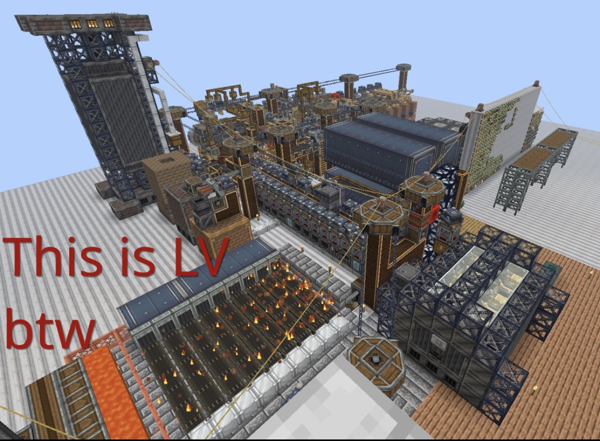

# Challenges 
Besides the default gamemode, Star Technology can be played in 2 different "challenge" modes, namely, Abydos mode and Hard mode. It should be noted that these 2 gamemodes are not at the same place in terms of development.

## Hard Mode
A much harder rendition of the main game. Highly recommended that you attempt this mode after completing the main mode. If you thought that this wiki would guide you through it, think again. **0 DOCUMENTATION**, you're all on your own

## Abydos Start
Why work towards the Classic Stargate to reach Abydos when you can just start there? Start your journey in abydos, a vast dessert, and try to make your way back home. There are only minor differences in this mode. Most of the progression is the same as normal. 
