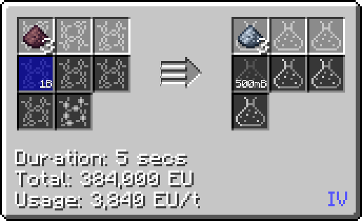

# Carbonic Acid (H~3~PO~4~)
<small>**Guide by:** humanoferth</small>

!!! quote ""

Carbonic Acid is available in <IV>**IV**</IV> and is used in the processing of Abydos Magma byproducts.

## Making Carbonic Acid

Carbonic acid is made in the LCR by reacting Potassium Carbonate with Hydrogen.

It is also a byproduct of making Disodium Salt of Hydroquinone dust.