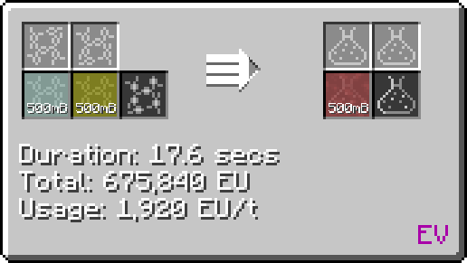

# Chlorosulfonic Acid (HSO~3~Cl)
<small>**Guide by:** humanoferth</small>

!!! quote ""

Chlorosulfonic Acid is available in <EV>**EV**</EV> and is used in the production of [PEDOT:PSS](/StarT-Wiki/Chemical-Lines/Plastics/PEDOT-PSS/).

## Making Chlorosulfonic Acid

Chlorosulfonic Acid is made in a Large / regular Chemical Reactor by reacting Hydrogen Chloride and Sulfur Trioxide.

