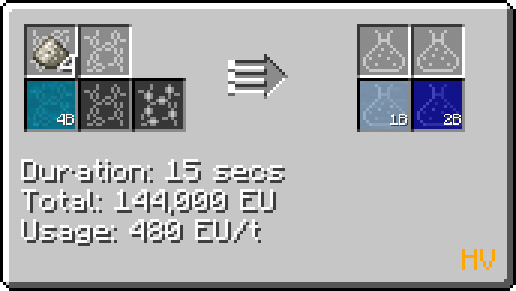

# Fluoroantimonic Acid (H~2~SbF~7~)
<small>**Guide by:** humanoferth</small>

!!! quote ""

Fluoroantimonic Acid is available in <HV>**HV**</HV> and is used in the processing of Naquadah.

## Making Fluoroantimonic Acid

Fluoroantimonic Acid is made Antimony Trifluoride and [Hydrofluoric Acid](/StarT-Wiki/Chemical-Lines/Acids/Hydrofluoric-Acid/) in the Large / regular Chemical Reactor. 

