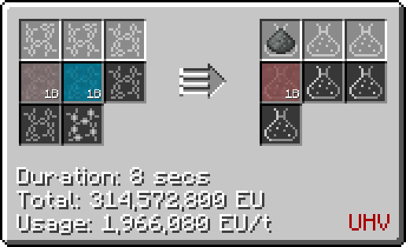

# Hexafluorobromic Acid (H(BrF~6~))
<small>**Guide by:** humanoferth</small>

!!! quote ""

Hexafluorobromic Acid is available in <UV>**UHV**</UV> and is used in the processing of atomic nether sludge dust.

## Making Hexafluorobromic Acid

Hexafluorobromic Acid is made in the LCR by reacting Caesium Hexafluoride and Hydrofluoric Acid.

