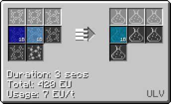

# Hydrofluoric Acid (HF)
<small>**Guide by:** humanoferth</small>

!!! quote ""

Hydrofluoric Acid is available as early on as <LV>**LV**</LV> and is used in a couple of recipes including [Polytetrafluoroethylene](/StarT-Wiki/Chemical-Lines/Plastics/Polytetrafluoroethylene/) and Uranium Hexafluoride.

# Making Hydrofluoric Acid

Hydrofluoric Acid is most easily made by reacting Hydrogen and Fluorine directly in a Large / regular Chemical Reactor. 

This is the best recipe for making Hydrofluoric Acid. While Hydrogen is abundant (mainly via the formic acid loop), Fluorine is more difficult to obtain. Methods of obtaining Fluorine include electrolysis of Topaz (from Rock Filtrator or Mystical Agriculture), Lepidolite (Void Extractor processing), or Biotite (Deepslate processing).

It is also a byproduct of a couple of recipes, including Fluorobenzene, though they are few and far between.