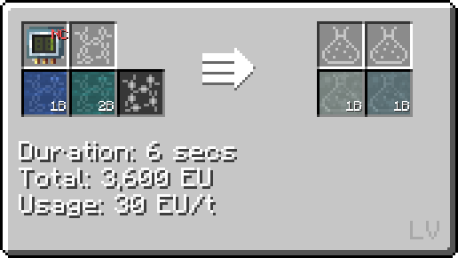
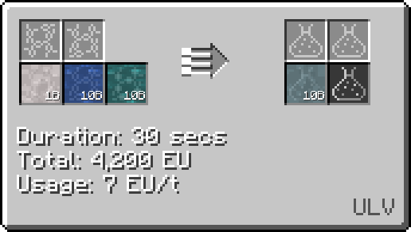

# Hypochlorous Acid (HClO)
<small>**Guide by:** humanoferth</small>

!!! quote ""

Hypochlorous Acid is available as early as <LV>**LV**</LV> and is used in the production of [Epoxy](/StarT-Wiki/Chemical-Lines/Plastics/Epoxy/).

## Making Hyprochlorous Acid

Hypochlorous Acid is made in the Large / regular chemical reactor:

!!! example ""

    === "Without Mercury"

        This recipe takes water and Chlorine on circuit 1:

        

        This recipe incurs a loss of .5B of chlorine even if you process the dilute Hydochloric Acid. It is also slower per bucket, with its only upside being that it doesn't use mercury. 

    === "With Mercury"

        This recipe takes water, Mercury, and Chlorine on circuit 1:

        

        This recipe does not incur loss and is faster then the latter. If your not cosuming mercury already for ore processing then this recipe is a viable option.