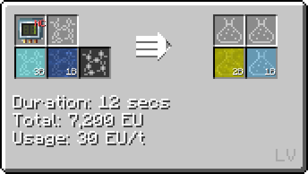
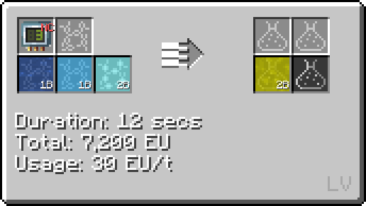
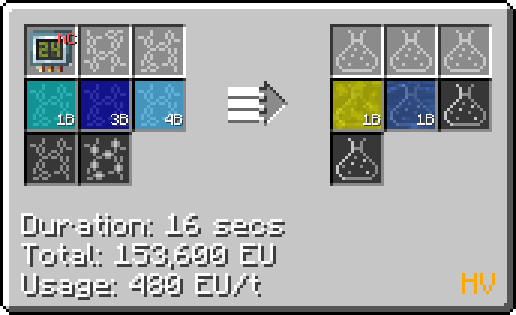
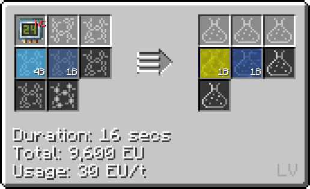

# Nitric Acid (HNO~3~)
<small>**Guide by:** humanoferth</small>

!!! quote ""

Nitric Acid is available as early as <LV>**LV**</LV> and has a few important uses. Its most important use is in the Platline (both for Aqua Regia and processing purified ore) and Nitration Mixture (used in Nitrobenzene production).

## Making Nitric Acid

### Chemical Reactor

These recipes can also be used in the LCR.

!!! example ""

    === "Nitrogen Dioxide + Water"

        This recipe takes Nitrogen Dioxide and water on circuit 1.

        

        When considering the time to craft Nitrogen Dioxide, this recipe is slower then its counterpart.

    === "Nitrogen Dioxide + Water + Oxygen"

        This recipe takes Nitrogen Dioxide, water, and Oxygen on circuit 3.

        

        When considering the time to craft Nitrogen Dioxide, this recipe is faster then its counterpart.

### Large Chemical Reactor

!!! example ""

    === "Elements skip"

        This recipe takes Nitrogen, Hydrogen, and Oxygen on circuit 24.

        

        This recipe is a good choice once you can produce enough energy to take advantage of the perfect overclock.
    === "Ammonia skip"

        This recipe takes Ammonia and Oxygen circuit 24.

        

        While this recipe may may appear faster then its counterpart, the time to make Ammonia causes it to be about the same. This is only faster if you already have Ammonia stockpiled from another source (Distillation, a separate passive, etc).