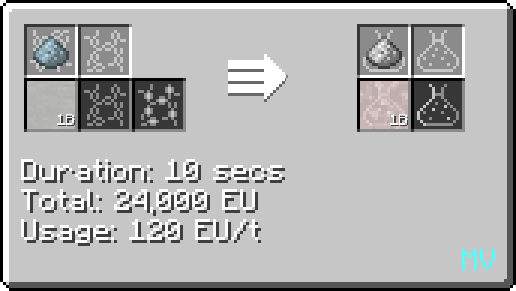
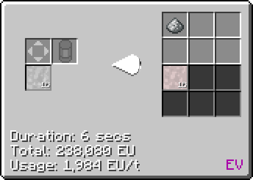
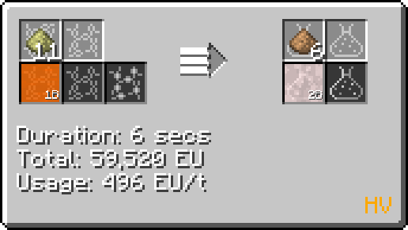

# Perchloric Acid (HClO~4~)
<small>**Guide by:** humanoferth</small>

!!! quote ""

Perchloric Acid is available as early as <MV>**MV**</MV> and is looped in Titanite proc.

## Making Perchloric Acid

Perchloric Acid can be initially made from Sodium Perchlorate and [Hydrochloric Acid](/StarT-Wiki/Chemical-Lines/Acids/Hydrochloric-Acid/):

During Titanite processing, it can be fully recovered by centrifuging Silica Gel and reacting Calcium Perchlorate with [Sulfuric Acid](/StarT-Wiki/Chemical-Lines/Acids/Sulfuric-Acid/) in a Large / regular Chemical Reactor. This loop incurs no loss of Perchloric Acid.

