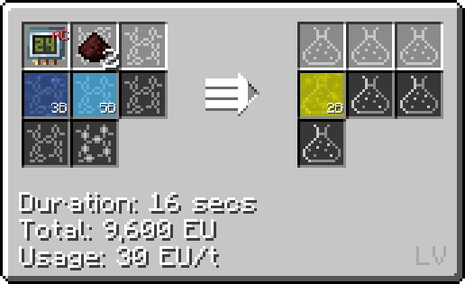

# Phosphoric Acid (H~3~PO~4~)
<small>**Guide by:** humanoferth</small>

!!! quote ""

Phosphoric Acid is available as early as <LV>**LV**</LV> but is only really used in the production of [PEDOT:PSS](/StarT-Wiki/Chemical-Lines/Plastics/PEDOT-PSS/) in <UEV>**UEV**</UEV>, the production of Polonium Flux, and the production of Sterilized growth medium in <ZPM>**ZPM**</ZPM>.

## Making Phosphoric Acid

Phosphoric acid is made in the Large / regular Chemical Reactor. The only real recipe you'll need to use is the LCR skip that uses Phosphorous, Oxygen, and water on circuit 24:

Other recipes for Phosphoric Acid include:

- Phosphorous Pentoxide and water in chemical reactor (available before the LCR, uses less energy overall).
- Apatite, Sulfuric acid, and water in a chemical reactor (would not recommend, has a low yield and Apatite has better uses).
- As a byproduct in Estalt production.