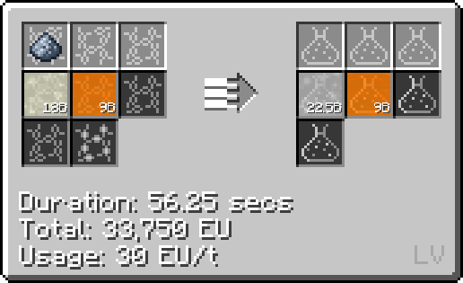
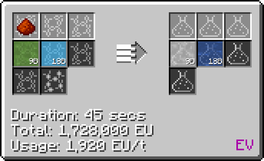

# Phthalic Acid (C~6~H~4~(CO~2~H)~2~)
<small>**Guide by:** humanoferth</small>

!!! quote ""

Phthalic Acid is an acid available as early as <LV>**LV**</LV> and is used in the production of [Polybenzimidazole](/StarT-Wiki/Chemical-Lines/Plastics/Polybenzimidazole/).

## Making Phthalic Acid

Phthalic Acid is made in the LCR:

!!! example ""

    === "Potassium + Naphthalene"

        This recipe takes Potassium, Naphthalene, and Sulfuric Acid:

        

        I would probably go with this one over the latter since it takes less steps and by this point you probably already have easy access to sufluric acid with the other two passived from ore proc and oil proc respectively. This recipe is also faster per bucket.

    === "Potassium Dichromate + Dimethylbenzene"

        This recipe takes Potassium Dichromate, Dimethylbenzene, and Oxygen:

        

        The latter recipe is probably better since you'll be required to set up potassium dichromate, which doesn't have any other uses. This one is also slower per bucket then the latter.

These recipes also have variants that use tiny piles of the same dust, where everything (including time) is divided by 9. I would recommend sticking with the regular dusts since it skips a step.