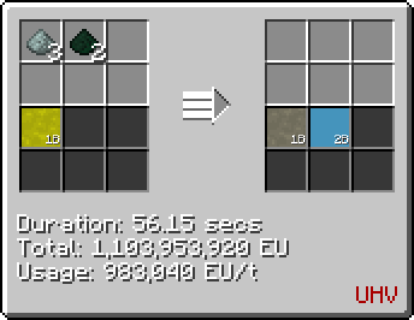

# Polonium Iridide Acid (IrPo~2~(H~3~PO~4~))
<small>**Guide by:** humanoferth</small>

!!! quote ""

Polonium Iridide Acid is available in <UEV>**UEV**</UEV> and is used in the production of Polonium Flux.

## Making Polonium Iridide Acid

Polonium Iridide Acid is made in the Chemical Plant by reacting Polonium Iridium(IV) Oxide with [Phosphoric Acid](/StarT-Wiki/Chemical-Lines/Acids/Phosphoric-Acid/)

