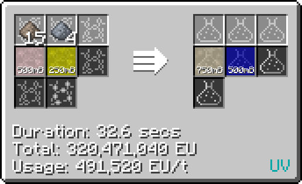

# Polyamic Acid (C~17~H~12~N~2~O~6~)
<small>**Guide by:** humanoferth</small>

!!! quote ""

Polyamic Acid is available in <UV>**UV**</UV> and is the last step in the production of [Polyimide](/StarT-Wiki/Chemical-Lines/Plastics/Polyimide/).

## Making Polyamic Acid

Polyamic Acid is made in the LCR 3,3',4,4'-Benzophenone Tetracarboxylic Dianhydride and N-Methyl-2-Pyrrolidone with Meta-Phenylenediamine and Nitric Acid.

