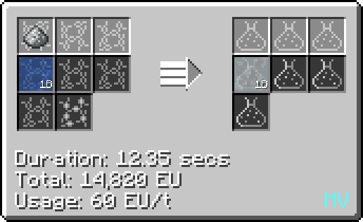

# Silicic Acid (H~2~SbF~7~)
<small>**Guide by:** humanoferth</small>

!!! quote ""

Silic Acid is available in <HV>**HV**<HV> and is used in the production of Biostimulating Mixture.

## Making Silicic Acid

Silicic Acid is made by reacting Water and Silicon Dioxide in an LCR.

It is also a byproduct in the production of Seaborgium.