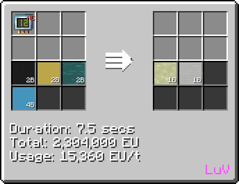
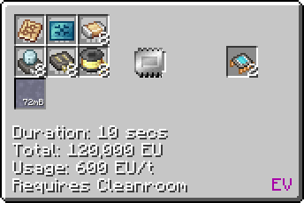
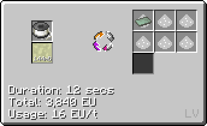
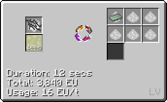
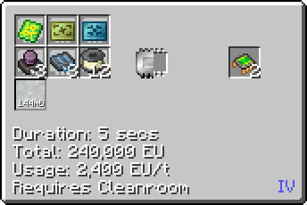

# Epoxy
<small>**Guide by:** ME Item Storage Cell</small>

!!! quote ""

A more complex acid made in <EV>EV</EV>, used for the construction of circuits up to <ZPM>ZPM</ZPM>.

## How to make Epoxy

### LCR

Epoxy needs various biomolecules to be made, so it is best to have wood distillation/oil drilling setup beforehand.

```mermaid
flowchart TD
    %%{init: { 'theme': 'neutral', 'themeVariables': { 'edgeLabelBackground': 'transparent', 'secondaryColor': 'transparent', 'tertiaryColor': 'transparent', 'labelBkgBackground' : 'transparent'}}}%%

    classDef invisible fill:none,stroke:none,color:none,stroke-width:0px

    subgraph P1 [" "]
        direction LR
        E@{ img: "https://start-dev-team.github.io/StarT-Wiki/Chemical-Lines/Plastics/Epoxy_img/distillery_distill_dilute_hcl_to_hydrochloric_acid.png", label: "Distillery", pos: "t", w: 200, h: 200, constraint: "on" }
    end
    class P1 invisible

    subgraph P2 [" "]
        direction LR
        D@{ img: "https://start-dev-team.github.io/StarT-Wiki/Chemical-Lines/Plastics/Epoxy_img/electrolyzer_salt_water_electrolysis.png", label: "Electrolyser", pos: "t", w: 200, h: 200, constraint: "on" }
    end
    class P2 invisible

    subgraph P3 [" "]
        direction LR
        C@{ img: "https://start-dev-team.github.io/StarT-Wiki/Chemical-Lines/Plastics/Epoxy_img/electrolyzer_decomposition_electrolyzing_hydrochloric_acid.png", label: "Electrolyser", pos: "t", w: 200, h: 200, constraint: "on" }
    end 
    class P3 invisible
    
    subgraph  P4 [" "]
        direction LR
        B@{ img: "https://start-dev-team.github.io/StarT-Wiki/Chemical-Lines/Plastics/Epoxy_img/large_chemical_reactor_epichlorohydrin_shortcut_water.png", label: "LCR", pos: "t", w: 200, h: 200, constraint: "on" }
        H@{ shape: lean-r, label: "4b/500mb Chlorine" }
        I@{ shape: lean-r, label: "1b Propene" }
        K@{ shape: lean-r, label: "1b Water" }
        H ==> B
        I ==> B
        K ==> B
    end
    class P4 invisible

    subgraph P5 [" "]
        A@{ img: "https://start-dev-team.github.io//StarT-Wiki/Chemical-Lines/Plastics/Epoxy_img/large_chemical_reactor_epoxy_shortcut.png", label: "LCR", pos: "t", w: 200, h: 200, constraint: "on" }
        F@{ shape: lean-r, label: "1b Acetone" }
        G@{ shape: lean-r, label: "2b Phenol" }
        J@{ shape: lean-l, label: "1b Liquid Epoxy" }
        F ==> A
        G ==> A
        A --> J
    end
    class P5 invisible
    
    L@{ shape: lean-l, label: "5.5b Hydrogen" }

    
    D ==3x Sodium Hydroxide dust==> A
    B ==1b Epichlorohydrin + 1b Hydrochloric Acid==> A
    A ==1b Salt Water==> D
    A ==1b Diluted Hydrochloric Acid==> E
    D ==3x Sodium Hydroxide dust==> B
    C ==1.5B Chlorine==> B
    B ==1b Salt Water==> D
    B ==1b Hydrochloric Acid==> C
    D ==2b Chlorine==> B
    D ==> L
    E ==500mb Hydrochloric Acid==>C
```

Looping is optional.

### Chem Plant

At <ZPM>ZPM</ZPM> you can use the Chemical Plant to directly synthesise epoxy from its substituent parts. You also get some extra Hydrochloric Acid.



## Uses of Epoxy

As mentioned before, Epoxy is used to make circuits, specifically for circuit boards.

### Epoxy Circuit Board

You can use Epoxy sheets to make blank Epoxy boards, which you can then etch before using in circuits. You would usually make the <HV>HV Nano Processor </HV> first.



### Fiber Reinforced Circuit Board

You make reinforced epoxy sheets using either Fine Borosilicate Glass wire or Carbon Fibers.

!!! example ""

    === "Borosilicate Glass"

        

    === "Carbon Fiber"

        

You then similarly make a Fiber Reinforced Board, before etching it an using in advanced circuits such as the <EV>EV Quantum Processor</EV>.

