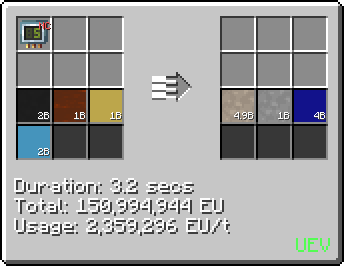
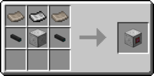
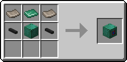
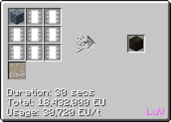

# Polyether Ether Ketone (PEEK)
<small>**Guide by:** ME Item Storage Cell</small>

!!! quote ""

PEEK is the best plastic. Unfortunately you have to wait until <LuV>LuV</LuV> to make it. If for some reason you decide not to, you will absolutely need to make it at <UHV>UHV</UHV>.

## How to make PEEK

### LCR
```mermaid { data-search-exclude }
flowchart TD
    %%{init: { 'theme': 'neutral', 'themeVariables': { 'edgeLabelBackground': 'transparent', 'secondaryColor': 'transparent', 'tertiaryColor': 'transparent', 'labelBkgBackground' : 'transparent' }}}%%

    classDef invisible fill:none,stroke:none,color:none,stroke-width:0px
    
    subgraph DisodiumOfHydroquinone [" "]
        direction TB

        subgraph SubSodaAshDust [" "]
            direction TB
            CarbonDioxideSA@{ shape: lean-r, label: "2b Carbon Dioxide" }
            SodiumHydroxideSA@{ shape: lean-r, label: "12x Sodium Hydroxide Dust" }
            SAProcess@{ img: "https://start-dev-team.github.io/StarT-Wiki/Chemical-Lines/Plastics/PEEK_img/large_chemical_reactor_soda_ash_from_carbon_dioxide.png", label: "LCR", pos: "t", w: 200, h: 200, constraint: "on" }
            SAWater@{ shape: lean-l, label: "2b Water" }

            CarbonDioxideSA & SodiumHydroxideSA --> SAProcess
            SAProcess --> SAWater
        end
        class SubSodaAshDust invisible

        subgraph SubHydroquinonedust [" "]
            direction TB
            BenzeneHQ@{ shape: lean-r, label: "2b Benzene" }
            OxygenHQ@{ shape: lean-r, label: "2b Oxygen" }
            PropeneHQ@{ shape: lean-r, label: "2b Propene" }
            HQProcess@{ img: "https://start-dev-team.github.io/StarT-Wiki/Chemical-Lines/Plastics/PEEK_img/large_chemical_reactor_hydroquinone_process.png", label: "LCR", pos: "t", w: 200, h: 200, constraint: "on" }

            PropeneR@{ img: "https://start-dev-team.github.io/StarT-Wiki/Chemical-Lines/Plastics/PEEK_img/electrolyzer_acetone_electrolysis.png", label: "LCR", pos: "t", w: 200, h: 200, constraint: "on" }
            RCarbon@{ shape: lean-l, label: "3x Carbon" }
            RWater@{ shape: lean-l, label: "2b Water" }

            BenzeneHQ & OxygenHQ & PropeneHQ --> HQProcess
            HQProcess --2b Acetone--> PropeneR
            PropeneR --1b Propene--> HQProcess
            PropeneR --> RCarbon & RWater
        end
        class SubHydroquinonedust invisible

        DHProcess@{ img: "https://start-dev-team.github.io/StarT-Wiki/Chemical-Lines/Plastics/PEEK_img/large_chemical_reactor_disodium_salt_of_hydroquinone_process.png", label: "LCR", pos: "t", w: 200, h: 200, constraint: "on" }
        DHCarbonic@{ shape: lean-l, label: "2b Carbonic Acid" }

        HQProcess --28x Hydroquinone Dust--> DHProcess
        SAProcess --12x Soda Ash Dust--> DHProcess
        DHProcess --> DHCarbonic
    end
    class DisodiumOfHydroquinone invisible

    
    subgraph SubPEEK [" "]
        direction TB
        PEEKProcess@{ img: "https://start-dev-team.github.io/StarT-Wiki/Chemical-Lines/Plastics/PEEK_img/large_chemical_reactor_peek_process.png", label: "LCR", pos: "t", w: 200, h: 200, constraint: "on" }
        PEEK@{ shape: lean-l, label: "9.8b Polyether Ether Ketone" }
        PEEKSodiumFluoride@{ shape: lean-l, label: "8x Sodium Fluoride Dust" }

        PEEKProcess --> PEEK
        PEEKProcess --> PEEKSodiumFluoride
    end
    class SubPEEK invisible
    

    subgraph Difluorobenzophenone [" "]

        subgraph SubFluorobenzene [" "]
            direction TB
            BenzeneFB@{ shape: lean-r, label: "2b Benzene" }
            FluorineFB@{ shape: lean-r, label: "4b Fluorine" }
            FBProcess@{ img: "https://start-dev-team.github.io/StarT-Wiki/Chemical-Lines/Plastics/PEEK_img/large_chemical_reactor_fluorobenzene_process.png", label: "LCR", pos: "t", w: 200, h: 200, constraint: "on" }
            HydrofluoricAcidFB@{ shape: lean-l, label: "2b Hydrofluoric Acid" }

            BenzeneFB & FluorineFB --> FBProcess
            FBProcess --> HydrofluoricAcidFB
        end
        class SubFluorobenzene invisible

        subgraph SubFluorobenzoylChloride [" "]
            direction TB
            BenzeneBT@{ shape: lean-r, label: "2b Toluene" }
            ChlorineBT@{ shape: lean-r, label: "6b Chlorine" }
            BTProcess@{ img: "https://start-dev-team.github.io/StarT-Wiki/Chemical-Lines/Plastics/PEEK_img/large_chemical_reactor_benzotrichloride_process.png", label: "LCR", pos: "t", w: 200, h: 200, constraint: "on" }
            BTHydrogen@{ shape: lean-l, label: "6b Hydrogen" }

            WaterBC@{ shape: lean-r, label: "2b Water" }
            BCProcess@{ img: "https://start-dev-team.github.io/StarT-Wiki/Chemical-Lines/Plastics/PEEK_img/large_chemical_reactor_benzoyl_chloride_process.png", label: "LCR", pos: "t", w: 200, h: 200, constraint: "on" }
            HydrochloricBC@{ shape: lean-l, label: "4b Hydrochloric Acid" }

            FluorineFC@{ shape: lean-r, label: "2b Fluorine" }
            FCProcess@{ img: "https://start-dev-team.github.io/StarT-Wiki/Chemical-Lines/Plastics/PEEK_img/large_chemical_reactor_4_fluorobenzoyl_chloride_process.png", label: "LCR", pos: "t", w: 200, h: 200, constraint: "on" }
            FCHydrogen@{ shape: lean-l, label: "2b Hydrogen" }

            BenzeneBT & ChlorineBT --> BTProcess
            BTProcess --> BTHydrogen

            BTProcess --2b Benzotrichloride--> BCProcess
            WaterBC --> BCProcess
            BCProcess --> HydrochloricBC

            BCProcess --2b Benzoyl Chloride--> FCProcess
            FluorineFC --> FCProcess
            FCProcess --> FCHydrogen
        end
        class SubFluorobenzoylChloride invisible
        
        DBPProcess@{ img: "https://start-dev-team.github.io/StarT-Wiki/Chemical-Lines/Plastics/PEEK_img/large_chemical_reactor_44_difluorobenzophenone_process.png", label: "LCR", pos: "t", w: 200, h: 200, constraint: "on" }
        DBPHydrochloric@{ shape: lean-l, label: "2b Hydrochloric Acid" }

        FBProcess --2b Fluorobenzene--> DBPProcess
        FCProcess --2b 4-Fluorobenzoyl Chloride--> DBPProcess
        DBPProcess --> DBPHydrochloric
    end
    class Difluorobenzophenone invisible

    

    

    DHProcess --28x Disodium Salt of Hydroquinone Dust--> PEEKProcess
    DBPProcess --"48x 4,4-Difluorobenzophenone Dust"--> PEEKProcess

```

A long, but worthy process for the best plastic. Some of the recycling steps has been left out of the flowchart, and here they are:

- Electrolysing Hydrofluoric Acid to recycle Fluorine you used, with Hydrogen as a bonus
- Electrolysing Hydrochloric Acid to recycle Chlorine, with more Hydrogen as a bonus

!!! tip ""s
    === "Inputs"
        - 2b Toluene
        - 6b Chlorine (Can be partially recycled)
        - 2b Water
        - 6b Fluorine (Can be recycled)
        - 2b Benzene
        - 2b Oxygen
        - 2b Propene (Can be partially recycled)
        - 2b Carbon Dioxide
        - 12x Sodium Hydroxide Dust

    === "Outputs"
        - 2b Hydrogen
        - 6b Hydrochloric Acid (Used for recycling)
        - 2b Hydrofluoric Acid (Used for recycling)
        - 2b Acetone (Used for recycling)
        - 4b Water
        - 2b Carbonic Acid
        - 3x Carbon Dust
        - 8x Sodium Fluoride Dust
        - 9.8b PEEK


### Chem Plant
Using PEEK to make PEEK, truly industry at its greatest. Inputs and outputs remain mostly the same, removing some trivial/useless ones. However, you will need to wait until <UHV>UHV</UHV> to overclock you Chem Plant to <UEV>UEV</UEV>.



!!! tip ""
    === "Inputs"
        - Benzene
        - Toluene
        - Propene
        - Oxygen

    === "Outputs"
        - PEEK
        - Acetone
        - Hydrogen 


## Uses of PEEK

PEEK is used as a sheet in both <UHV>UHV</UHV> and <UEV>UEV</UEV> machine hulls 

!!! example ""

    === "UHV"

        

    === "UEV"

        

### Chemical Plant

The Chemical Plant, or Chem Plant for short, is quite a useful multiblock. Making a Chem Plant requires PEEK, as it is largely composed of PEEK Casing.


