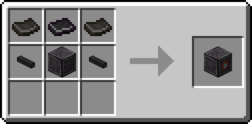
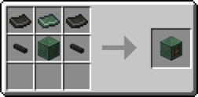
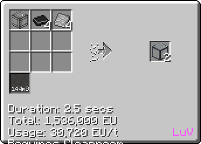
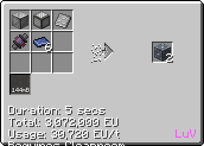

# Polybenzimidazole (PBI)
<small>**Guide by:** ME Item Storage Cell</small>

!!! quote ""

PBI is the <ZPM>ZPM</ZPM> plastic, which you will use until <Uv>UV</UV>.

## How to make PBI

```mermaid
flowchart TD
    %%{init: { 'theme': 'neutral', 'themeVariables': { 'edgeLabelBackground': 'transparent', 'secondaryColor': 'transparent', 'tertiaryColor': 'transparent', 'labelBkgBackground' : 'transparent' }}}%%

    classDef invisible fill:none,stroke:none,color:none,stroke-width:0px


    subgraph SubDiaminobenzidine [" "]
        direction TD
        NitricNM@{ shape: lean-r, label: "90b Nitric Acid" }
        SulfuricNM@{ shape: lean-r, label: "45b Sulfuric Acid" }
        NMProcess@{ img: "https://start-dev-team.github.io/StarT-Wiki/Chemical-Lines/Plastics/PBI_img/mixer_nitration_mixture.png", label: "Mixer", pos: "t", w: 200, h: 200, constraint: "on" }

        ChlorineCB@{ shape: lean-r, label: "180b Chlorine" }
        BenzeneCB@{ shape: lean-r, label: "90b Benzene" }
        CBProcess@{ img: "https://start-dev-team.github.io/StarT-Wiki/Chemical-Lines/Plastics/PBI_img/large_chemical_reactor_chlorobenzene.png", label: "LCR", pos: "t", w: 200, h: 200, constraint: "on" }
        CBHydrochloric@{ shape: lean-l, label: "90b Hydrochloric Acid" }

        NCBProcess@{ img: "https://start-dev-team.github.io/StarT-Wiki/Chemical-Lines/Plastics/PBI_img/large_chemical_reactor_nitrochlorobenzene.png", label: "LCR", pos: "t", w: 200, h: 200, constraint: "on" }

        CopperDCB@{ shape: lean-r, label: "5x Copper Dust" }
        HydrogenDCB@{ shape: lean-r, label: "90b Hydrogen" }
        DCBProcess@{ img: "https://start-dev-team.github.io/StarT-Wiki/Chemical-Lines/Plastics/PBI_img/large_chemical_reactor_dichlorobenzidine_9.png", label: "LCR", pos: "t", w: 200, h: 200, constraint: "on" }

        AmmoniaDAB@{ shape: lean-r, label: "90b Ammonia"}
        DABProcess@{ img: "https://start-dev-team.github.io/StarT-Wiki/Chemical-Lines/Plastics/PBI_img/large_chemical_reactor_diaminobenzidine.png", label: "LCR (Zinc NC)", pos: "t", w: 200, h: 200, constraint: "on" }
        DABHydrochloric@{ shape: lean-l, label: "90b Hydrochloric Acid"}

        DSProcess@{ img: "https://start-dev-team.github.io/StarT-Wiki/Chemical-Lines/Plastics/PBI_img/distillery_distill_dilute_sulfuric_to_sulfuric_acid_2.png", label: "Distillery", pos: "t", w: 200, h: 200, constraint: "on" }

        NitricNM --> NMProcess
        SulfuricNM --> NMProcess

        ChlorineCB --> CBProcess
        BenzeneCB --> CBProcess
        CBProcess --> CBHydrochloric

        NMProcess --180b Nitration Mixture---> NCBProcess
        CBProcess --90b Chlorobenzene---> NCBProcess
        NMProcess ~~~ CBProcess
        NCBProcess --90b Diluted Sulfuric Acid--> DSProcess
        DSProcess ~~~ NCBProcess

        CopperDCB --> DCBProcess
        HydrogenDCB --> DCBProcess
        NCBProcess --90b Nitrochlorobenzene--> DCBProcess

        AmmoniaDAB --> DABProcess
        DCBProcess --45b Dichlorobenzidine--> DABProcess
        DABProcess --> DABHydrochloric
        DABProcess ~~~ DABHydrochloric

        DSProcess --45b Sulfuric Acid--> NMProcess


        end
        class SubDiaminobenzidine invisible

        subgraph SubDiphenylIsophthalate [" "]
            direction TD
            NaphthalenePhthalic@{ shape: lean-r, label: "38b Naphthalene"}
            PotassiumPhthalic@{ shape: lean-r, label: "2x Potassium Dust"}
            PhthalicProcess@{ img: "https://start-dev-team.github.io/StarT-Wiki/Chemical-Lines/Plastics/PBI_img/large_chemical_reactor_phthalic_acid_from_naphthalene_9.png", label: "LCR", pos: "t", w: 200, h: 200, constraint: "on" }

            OxygenSulfuric@{ shape: lean-r, label: "72b Oxygen"}
            SulfuricProcess@{ img: "https://start-dev-team.github.io/StarT-Wiki/Chemical-Lines/Plastics/PBI_img/large_chemical_reactor_sulfuric_acid_from_sulfide.png", label: "LCR", pos: "t", w: 200, h: 200, constraint: "on" }

            PhenolDI@{ shape: lean-r, label: "90b Phenol"}
            SulfuricDI@{ shape: lean-r, label: "22.5b Sulfuric Acid"}
            DIProcess@{ img: "https://start-dev-team.github.io/StarT-Wiki/Chemical-Lines/Plastics/PBI_img/large_chemical_reactor_diphenyl_isophtalate.png", label: "LCR", pos: "t", w: 200, h: 200, constraint: "on" }
            DSAProcess@{ img: "https://start-dev-team.github.io/StarT-Wiki/Chemical-Lines/Plastics/PBI_img/distillery_distill_dilute_sulfuric_to_sulfuric_acid_2.png", label: "LCR", pos: "t", w: 200, h: 200, constraint: "on" }


            NaphthalenePhthalic & PotassiumPhthalic --> PhthalicProcess
            PhthalicProcess --18b Hydrogen Sulfide--> SulfuricProcess
            PhthalicProcess --45b Phthalic Acid--> DIProcess
            
            OxygenSulfuric --> SulfuricProcess
            OxygenSulfuric ~~~ SulfuricProcess
            SulfuricProcess --18b Sulfuric Acid--> PhthalicProcess

            PhenolDI & SulfuricDI --> DIProcess
            DIProcess --45b Dilute Sulfuric Acid--> DSAProcess
            DSAProcess --22.5b Sulfuric Acid--> DIProcess

        
        end
        class SubDiphenylIsophthalate invisible


    subgraph SubPolybenzimidazole [" "]
        direction TD
        PBIProcess@{ img: "https://start-dev-team.github.io/StarT-Wiki/Chemical-Lines/Plastics/PBI_img/large_chemical_reactor_polybenzimidazole.png", label: "LCR", pos: "t", w: 200, h: 200, constraint: "on" }
        PBI@{ shape: lean-l, label: "45.45b Polybenzimidazole"}
        PBIPhenol@{ shape: lean-l, label: "45b Phenol"}

        PBIProcess --> PBI & PBIPhenol
    end
    class SubPolybenzimidazole invisible

    DIProcess --45b Diphenyl Isophtalate--> PBIProcess
    DABProcess --45b Diaminobenzidine--> PBIProcess
    DSAProcess ~~~ CopperDCB

```

As evident by the flowchart, PBI is one of the more complex plastics to make. Don't worry, it only gets worse from here on. Do note however, the I/O in this flowchart has been balanced. You can make PBI with far less materials, you would just have left overs in some places.

!!! tip ""
    === "Inputs"
        - 38b Naphthalene
        - 2x Potassium Dust
        - 90b Phenol (45 if you recycle)
        - 67.5b Sulfuric Acid (135 without distillation, 153 if you store Hydrogen Sulfide for SPT boosting)
        - 72b Oxygen (if you recycle Hydrogen Sulfide)
        - 90b Nitric Acid
        - 180b Chlorine
        - 90b Benzene
        - 90b Hydrogen
        - 5x Copper Dust
        - 90b Ammonia

    === "Outputs"
        - 45.45b PBI
        - 45b Phenol (without recycling)
        - 180b Hydrochloric Acid
        - 135b Diluted Sulfuric Acid (You should really distill this)

## Uses of PBI

You will need it as a sheet to make both <ZPM>ZPM</ZPM> and <UV>UV</UV> machine hulls.

!!! example ""

    === "ZPM"

        

    === "UV"

        

Along with being used for other <ZPM>ZPM</ZPM> and <UV>UV</UV> components, you will need PBI to make fusion glass and fusion casings, for your first fusion reactors, the MK1.

!!! example ""

    === "Fusion Glass"

        

        <small>Requires Cleanroom, text got cut off in JEI</small>

    === "Fusion Casing"

        

        <small>Requires Cleanroom, text got cut off in JEI</small>

