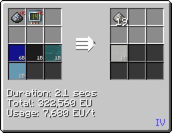
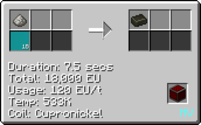
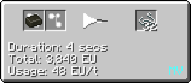

# Polycaprolactam (Nylon 6)
<small>**Guide by:** ME Item Storage Cell</small>

!!! quote ""

Another optional plastic you can make in <hv>HV</hv>. The only real use for it is to make lots of string very quickly. Especially useful if you don't have flax automated.

## How to make Nylon 6

### Caprolactam

#### LCR
```mermaid
flowchart TD
    %%{init: { 'theme': 'neutral', 'themeVariables': { 'edgeLabelBackground': 'transparent', 'secondaryColor': 'transparent', 'tertiaryColor': 'transparent', 'labelBkgBackground' : 'transparent' }}}%%

    classDef invisible fill:none,stroke:none,color:none,stroke-width:0px

    subgraph P1 [" "]
        direction LR
        F@{ shape: lean-r, label: "2b Benzene", constraint: "on" }
        G@{ shape: lean-r, label: "12b Hydrogen", constraint: "on" }
        A@{ img: "https://start-dev-team.github.io/StarT-Wiki/Chemical-Lines/Plastics/Nylong6_img/large_chemical_reactor_cyclohexane.png", label: "LCR (Nickel Catalyst)", pos: "t", w: 200, h: 200, constraint: "on" }
        F --> A
        G --> A
    end
    class P1 invisible

    subgraph P2 [" "]
        direction LR
        H@{ shape: lean-r, label: "5b Nitrogen Oxide", constraint: "on" }
        I@{ shape: lean-r, label: "2b Ammonia", constraint: "on" }
        B@{ img: "https://start-dev-team.github.io/StarT-Wiki/Chemical-Lines/Plastics/Nylong6_img/large_chemical_reactor_nitric_oxide_from_ammonia.png", label: "LCR", pos: "t", w: 200, h: 200, constraint: "on" }
        O@{ shape: lean-l, label: "3b Water", constraint: "on" }
        H --> B
        I --> B
        B --> O
    end
    class P2 invisible

    subgraph P3 [" "]
        direction LR
        J@{ shape: lean-r, label: "2b Chlorine", constraint: "on" }
        C@{ img: "https://start-dev-team.github.io/StarT-Wiki/Chemical-Lines/Plastics/Nylong6_img/large_chemical_reactor_nitrosyl_chloride.png", label: "LCR", pos: "t", w: 200, h: 200, constraint: "on" }
        J --> C
    end
    class P3 invisible

    subgraph P4 [" "]
        direction LR
        D@{ img: "https://start-dev-team.github.io/StarT-Wiki/Chemical-Lines/Plastics/Nylong6_img/large_chemical_reactor_cyclohexanone_oxime.png", label: "LCR", pos: "t", w: 200, h: 200, constraint: "on" }
        M@{ shape: lean-l, label: "2b Hydrochloric Acid", constraint: "on" }
        D --> M
    end
    class P4 invisible
    
    subgraph P5 [" "]
        direction LR
        K@{ shape: lean-r, label: "2b Sulfuric Acid", constraint: "on" }
        E@{ img: "https://start-dev-team.github.io/StarT-Wiki/Chemical-Lines/Plastics/Nylong6_img/large_chemical_reactor_caprolactam.png", label: "LCR", pos: "t", w: 200, h: 200, constraint: "on" }
        N@{ shape: lean-l, label: "2b Diluted Sulfuric Acid", constraint: "on" }
        L@{ shape: lean-l, label: "38 Caprolactam dust", constraint: "on" }
        K --> E
        E --> N
        E --> L
    end
    class P5 invisible

    B -- "2b Nitric Oxide" --> C
    A -- "2b Cyclohexane" --> D
    C -- "2b Nitrosyl Chloride" --> D
    D -- "38 Cyclohexanone Oxime Dust" --> E
```

#### Chem Plant Skip
In <zpm>ZPM</zpm>, you can use the chemical plant to make Caprolactam in 1 step. Then you just have to smelt it.



### Polymerisation
Most plastics get polymerised in a chemical reactor, with either air or oxygen. Nylon 6 is the exception to the rule however, and instead uses the EBF. You need Nitrogen as well.



## Uses of Nylon 6
The most common use of Nylon 6 is the production of string. It is incredibly efficient, producing half a stack per ingot.

