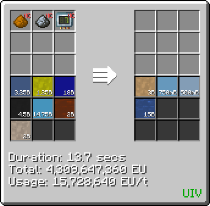
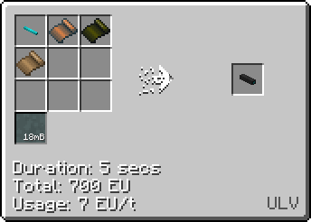

# Poliyimide (PI)
<small>**Guide by:** ME Item Storage Cell</small>

!!! quote ""

PI is the most advanced plastic used to insulate cables, used in conjunction with [PVC](Polyvinyl-Acetate.md) and [PPS](Polyphenylene-Sulfide.md). You will need it from <UHV>UHV</UHV> onwards. 

In case you were wondering, it is pronounced close to *pol*-*yimide*, not *poly*-*mide*, or <br /> *poly*-*imide*.

## How to make PI

### LCR + Chem Plant
```mermaid { data-search-exclude }
flowchart TD
    %%{init: { 'theme': 'neutral', 'themeVariables': { 'edgeLabelBackground': 'transparent', 'secondaryColor': 'transparent', 'tertiaryColor': 'transparent', 'labelBkgBackground' : 'transparent' }}}%%

    classDef invisible fill:none,stroke:none,color:none,stroke-width:0px

    subgraph NMethyl2Pyrrolidone [" "]
        direction TB
        AmmoniaML@{ shape: lean-r, label: "36b Ammonia" }
        MLProcess@{ img: "https://start-dev-team.github.io/StarT-Wiki/Chemical-Lines/Plastics/Polyimide_img/large_chemical_reactor_methylamine.png", label: "LCR", pos: "t", w: 200, h: 200, constraint: "on" }
        MLWater@{ shape: lean-l, label: "36b Water" }

        Benzene14B@{ shape: lean-r, label: "18b Benzene" }
        Oxygen14B@{ shape: lean-r, label: "72b Oxygen" }
        Hydrogen14B@{ shape: lean-r, label: "216b Hydrogen" }
        14BProcess@{ img: "https://start-dev-team.github.io/StarT-Wiki/Chemical-Lines/Plastics/Polyimide_img/chemical_skip_14_butanediol_skip.png", label: "Chem Plant <br /> (Palladium on Carbon Catalyst)", pos: "t", w: 200, h: 200, constraint: "on" }
        
        OxygenYB@{ shape: lean-r, label: "72b Oxygen" }
        YBProcess@{ img: "https://start-dev-team.github.io/StarT-Wiki/Chemical-Lines/Plastics/Polyimide_img/large_chemical_reactor_y_butyrolactone.png", label: "LCR", pos: "t", w: 200, h: 200, constraint: "on" }
        YBWater@{ shape: lean-l, label: "72b Water" }

        NM2PProcess@{ img: "https://start-dev-team.github.io/StarT-Wiki/Chemical-Lines/Plastics/Polyimide_img/large_chemical_reactor_nmp.png", label: "LCR", pos: "t", w: 200, h: 200, constraint: "on" }
        NM2PWater@{ shape: lean-l, label: "36b Water" }

        AmmoniaML --> MLProcess 
        MLProcess --> MLWater

        Benzene14B & Oxygen14B & Hydrogen14B --> 14BProcess
        14BProcess --36b Methanol--> MLProcess

        14BProcess --36b 1,4-Butanediol--> YBProcess
        OxygenYB --> YBProcess
        YBProcess --> YBWater

        MLProcess --36b Methylamine--> NM2PProcess
        NM2PProcess --> NM2PWater
        YBProcess --36b γ-Butyrolactone--> NM2PProcess
        
    end
    class NMethyl2Pyrrolidone invisible

    subgraph BenzophenoneTetracarboxylicDianhydride [" "]
        direction TB
        TolueneBTD@{ shape: lean-r, label: "72b Toluene" }
        BenzeneBTD@{ shape: lean-r, label: "99.36b Benzene" }
        OxygenBTD@{ shape: lean-r, label: "711.36b Oxygen" }
        AceticAcidBTD@{ shape: lean-r, label: "72b Acetic Acid" }
        BTDProcess@{ img: "https://start-dev-team.github.io/StarT-Wiki/Chemical-Lines/Plastics/Polyimide_img/chemical_skip_benzophenone_3344_tetracarboxylic_dianhydridenediol_skip.png", label: "Chem Plant", pos: "t", w: 200, h: 200, constraint: "on" }
        BTDCarbonDioxide@{ shape: lean-l, label: "18b Carbon Dioxide" }
        BTDWater@{ shape: lean-l, label: "296.64b Water" }
        BTDHydrogen@{ shape: lean-l, label: "216b Hydrogen" }

        ChlorineR@{ img: "https://emi.expandium.net/packs/StarTechnology/eta3-hf2/recipes/gtceu/electrolyzer_decomposition_electrolyzing_hydrogen_chloride.png", label: "Electrolyser", pos: "t", w: 200, h: 200, constraint: "on" }
        RHydrogen@{ shape: lean-l, label: "216b Hydrogen" }

        TolueneBTD & BenzeneBTD & OxygenBTD & AceticAcidBTD --> BTDProcess
        
        ChlorineR --> RHydrogen
        BTDProcess --216b Hydrogen Chloride --> ChlorineR
        ChlorineR --216b Chlorine--> BTDProcess
        BTDProcess --> BTDCarbonDioxide
        BTDProcess --> BTDWater
        BTDProcess --> BTDHydrogen
    end
    class BenzophenoneTetracarboxylicDianhydride invisible

    subgraph Polyimide [" "]
        direction TB

        NitricAcidPA@{ shape: lean-r, label: "36b Nitric Acid" }
        PAProcess@{ img: "https://start-dev-team.github.io/StarT-Wiki/Chemical-Lines/Plastics/Polyimide_img/large_chemical_reactor_polyamic_acid.png", label: "LCR", pos: "t", w: 200, h: 200, constraint: "on" }
        PAHydrogen@{ shape: lean-l, label: "72b Hydrogen" }

        AmmoniaPolyimide@{ shape: lean-r, label: "54b Ammonia" }
        PolyimideProcess@{ img: "https://start-dev-team.github.io/StarT-Wiki/Chemical-Lines/Plastics/Polyimide_img/large_chemical_reactor_polyimide.png", label: "LCR", pos: "t", w: 200, h: 200, constraint: "on" }
        PolyimideWater@{ shape: lean-l, label: "189b Water" }
        PolyimideNitrousOxide@{ shape: lean-l, label: "27b Nitrous Oxide" }
        PI@{ shape: lean-l, label: "108b Polyimide" }

        NitricAcidPA --> PAProcess
        PAProcess --> PAHydrogen

        PAProcess --108b Polyamic Acid--> PolyimideProcess
        AmmoniaPolyimide --> PolyimideProcess
        PolyimideProcess --> PolyimideWater
        PolyimideProcess --> PolyimideNitrousOxide
        PolyimideProcess --> PI
    end
    class Polyimide invisible

    subgraph MetaPhenylenediamine [" "]
        direction TB
        NitricAcidNM@{ shape: lean-r, label: "18b Nitric Acid" }
        SulfuricAcidNM@{ shape: lean-r, label: "12b Sulfuric Acid" }
        NMProcess@{ img: "https://start-dev-team.github.io/StarT-Wiki/Chemical-Lines/Plastics/Polyimide_img/mixer_nitration_mixture.png", label: "Mixer", pos: "t", w: 200, h: 200, constraint: "on" }

        BenzeneNBZ@{ shape: lean-r, label: "45b Benzene" }
        DistilledWaterNBZ@{ shape: lean-r, label: "18b Distilled Water" }
        NBZProcess@{ img: "https://start-dev-team.github.io/StarT-Wiki/Chemical-Lines/Plastics/Polyimide_img/large_chemical_reactor_nitrobenzene.png", label: "LCR", pos: "t", w: 200, h: 200, constraint: "on" }

        SRProcess@{ img: "http://127.0.0.1:8000/StarT-Wiki/Chemical-Lines/Plastics/Polyimide_img/distillery_distill_dilute_sulfuric_to_sulfuric_acid.png", label: "Distillery", pos: "t", w: 200, h: 200, constraint: "on" }

        HydrogenMP@{ shape: lean-r, label: "624b Hydrogen" }
        AmmoniaMP@{ shape: lean-r, label: "24b Ammonia" }
        MPProcess@{ img: "https://start-dev-team.github.io/StarT-Wiki/Chemical-Lines/Plastics/Polyimide_img/large_chemical_reactor_m_phelyenediamine.png", label: "LCR (Nickel Catalyst)", pos: "t", w: 200, h: 200, constraint: "on" }
        MPWater@{ shape: lean-l, label: "144b Water" }

        NitricAcidNM & SulfuricAcidNM --> NMProcess

        
        BenzeneNBZ & DistilledWaterNBZ --> NBZProcess 
        NMProcess --18b Nitration Mixture--> NBZProcess

        NBZProcess --9b Diluted Sulfuric Acid--> SRProcess
        SRProcess --6b Sulfuric Acid--> NMProcess

        NBZProcess --72b Nitrobenzene--> MPProcess
        HydrogenMP & AmmoniaMP --> MPProcess
        MPProcess --> MPWater
    end
    class MetaPhenylenediamine invisible

    NM2PProcess --576x N-Methyl-2-Pyrrolidone Dust--> PAProcess
    BTDProcess --"2160x <br /> 3,3,4,4-Benzophenone <br /> Tetracarboxylic Dianhydride Dust"--> PAProcess
    MPProcess --72b <br /> Meta-Phenylenediamine--> PAProcess
``` 

About as long as the other plastics you would be making at this tier. The only real difference is the use of Chem Plants. You could forgo them, but it would make the recipe tree much longer. 

!!! tip ""
    === "Inputs"
        - 54b Nitric Acid
        - 12b Sulfuric Acid (18b without recycling)
        - 162.36b Benzene
        - 18b Distilled Water
        - 336b Hydrogen (840 without recycling)
        - 114b Ammonia
        - 855.36b Oxygen
        - 72b Toluene
        - 72b Acetic Acid
        - 216b Chlorine (Can be recycled)


    === "Outputs"
        - 773.64b Water
        - 27b Nitrous Oxide
        - 108b Polyimide
        - 18b Carbon Dioxide
        - 216b Hydrogen Chloride (Used for recycling)
        - 504b Hydrogen (Used for recycling)

Keep in mind the inputs and outputs for this line have been inflated for balancing purposes.

### Atomic Synthesis Plant
The Chem Plant is unable to reduce this line, and you will need to wait until <UIV>UIV</UIV> and use the Atomic Synthesis Plant instead. Inputs are mostly the same, just missing some related to Nitrobenzene.



!!! tip ""
    === "Inputs"
        - Palladium on Carbon Dust (Catalyst, Non-consumed)
        - Nickel Dust (Catalyst, Non-consumed)
        - Ammonia
        - Nitric Acid
        - Hydrogen
        - Benzene
        - Oxygen
        - Toluene
        - Acetic Acid

    === "Outputs"
        - Polyimide
        - Nitrous Oxide
        - Carbon Dioxide
        - Water

## Uses of PI
As mentioned before, PI is used as a foil to insulate cables in addition to PVC and PPS. You will first need it to make Europium Cable, used in <UHV>UHV</UHV> machine hulls, along with a variety of <UHV>UHV</UHV> machines and components. 



PI is the last plastic you need to insulate cables, for the rest of the game (for now, that is).