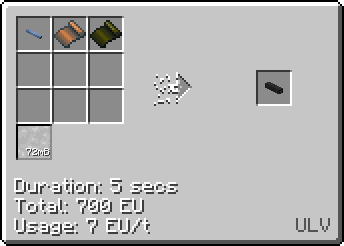

# Polyphenylene Sulfide (PPS)
<small>**Guide by:** ME Item Storage Cell</small>

!!! quote ""

A plastic you will need to make in <LUV>Luv</LUV> to make <ZPM>ZPM</ZPM> energy hatches. Compared to other mid-game plastics, PPS is pretty simple to make.

## How to make PPS
```mermaid
flowchart TD
    %%{init: { 'theme': 'neutral', 'themeVariables': { 'edgeLabelBackground': 'transparent', 'secondaryColor': 'transparent', 'tertiaryColor': 'transparent', 'labelBkgBackground' : 'transparent' }}}%%

    A@{ img: "https://start-dev-team.github.io/StarT-Wiki/Chemical-Lines/Plastics/PPS_img/large_chemical_reactor_sodium_sulfide.png", label: "LCR", pos: "t", w: 200, h: 200, constraint: "on" }

    B@{ img: "https://start-dev-team.github.io/StarT-Wiki/Chemical-Lines/Plastics/PPS_img/large_chemical_reactor_dichlorobenzene.png", label: "LCR", pos: "t", w: 200, h: 200, constraint: "on" }

    C@{ img: "https://start-dev-team.github.io/StarT-Wiki/Chemical-Lines/Plastics/PPS_img/large_chemical_reactor_polyphenylene_sulfide_from_oxygen.png", label: "LCR", pos: "t", w: 200, h: 200, constraint: "on" }

    D@{ shape: lean-r, label: "1x Sulfur Dust" }

    F@{ shape: lean-r, label: "2b Chlorine" }

    G@{ shape: lean-r, label: "1b Benzene" }

    H@{ shape: lean-l, label: "2b Hydrochloric Acid" }

    I@{ shape: lean-r, label: "6b Oxygen" }

    J@{ shape: lean-l, label: "1.5b Polyphenylene Sulfide" }

    K@{ img: "https://start-dev-team.github.io/StarT-Wiki/Chemical-Lines/Plastics/PPS_img/electrolyzer_decomposition_electrolyzing_salt.png", label: "LCR", pos: "t", w: 200, h: 200, constraint: "on" }

    D --> A
    K --2x Sodium Dust--> A
    A --3x Sodium Sulfide Dust--> C

    F --> B
    G --> B
    B --> H
    B --2b Dichlorobenzene--> C

    I --> C
    C --> J
    C --4x Salt--> K
    K --2b Chlorine-->B

```
Looping is optional. For the final step you can use air instead of oxygen, but it is less efficient, and at this stage you should have no issues sourcing oxygen.

## Uses of PPS

PPS is required to enter <ZPM>ZPM</ZPM>. The <ZPM>ZPM</ZPM> energy hatch and machine hull requires Vanadium Gallium Cable, which requires PPS foil to make.



PPS is also required for other cables, among other things.