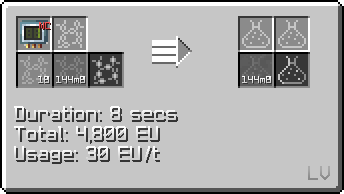
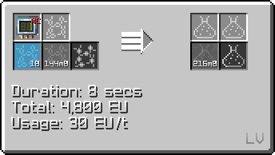

# Polytetrafluoroethylene (PTFE)
<small>**Guide by:** ME Item Storage Cell</small>

!!! quote ""

The third plastic in progression, made in <hv>HV</hv> to create the Large Chemical Reactor.

## How to make PTFE

### Tetrafluoroethylene

#### Pre-LCR
```mermaid
flowchart LR
    %%{init: { 'theme': 'neutral', 'themeVariables': { 'edgeLabelBackground': 'transparent', 'secondaryColor': 'transparent', 'tertiaryColor': 'transparent', 'labelBkgBackground' : 'transparent' }}}%%

    A@{ img: "https://start-dev-team.github.io/StarT-Wiki/Chemical-Lines/Plastics/PTFE_img/chemical_reactor_tetrafluoroethylene_from_chloroform.png", label: "Chemical Reactor", pos: "t", w: 200, h: 200, constraint: "on" }

    B@{ img: "https://start-dev-team.github.io/StarT-Wiki/Chemical-Lines/Plastics/PTFE_img/chemical_reactor_hydrofluoric_acid_from_elements.png", label: "Chemical Reactor", pos: "t", w: 200, h: 200, constraint: "on" }

    C@{ img: "https://start-dev-team.github.io/StarT-Wiki/Chemical-Lines/Plastics/PTFE_img/chemical_reactor_chloroform.png", label: "Chemical Reactor", pos: "t", w: 200, h: 200, constraint: "on" }

    D@{ shape: lean-r, label: "12b Chlorine" }

    E@{ shape: lean-r, label: "2b Methane" }

    F@{ shape: lean-r, label: "4b Hydrogen" }

    G@{ shape: lean-r, label: "4b Fluorine" }

    H@{ shape: lean-l, label: "12b Hydrochloric Acid" }

    I@{ shape: lean-l, label: "1b Tetrafluoroethylene" }

    B --4b Hydrofluoric Acid--> A
    C --2b Chloroform--> A
    A --> I
    A --> H
    F --> B
    G --> B
    D --> C
    E --> C
```
You can loop the Chlorine by electrolysing the extra HCl.


####  Post-LCR

In <ev>EV</ev>, you can overclock your LCR and make use of this circuit 24 recipe for quicker PTFE.


You skip Chloroform and instead use chlorine and methane directly, saving you a step. You still get the extra HCl

#### Chem Plant

You can use the Chemical Plant in <zpm>ZPM</zpm> to the other chemicals and simply react Carbon and Fluorine to directly get PTFE.


### Polymerisation

!!! example ""

    === "Air"

        

    === "Oxygen"

        

## Uses of PTFE

You will first use PTFE in <hv>HV</hv> to make an LCR. Every block that isn't the controller or i/o uses the plastic.


Used as a sheet in <iv>IV</iv> and <luv>LUV</luv> machine hulls.

!!! example ""

    === "IV"

        

    === "LUV"

        

Additionally, PTFE is used in making <iv>IV</iv> input/output busses/hatches

