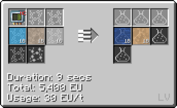
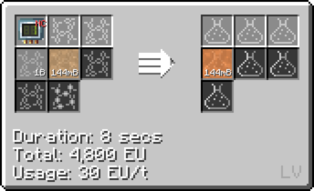
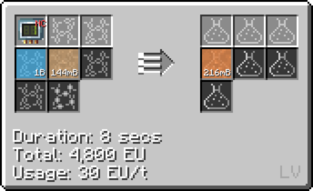
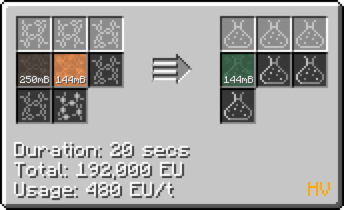

# Polyvinyl Acetate (PVA)
<small>**Guide by:** ME Item Storage Cell</small>

!!! quote ""

A plastic that everyone would have heard about before playing this pack. It isn't used as a glue here however, mainly just a component of [PVB](/StarT-Wiki/Chemical-Lines/Plastics/Polyvinyl-Butyral).

## How to make PVA

### Vinyl Acetate

Made with Oxygen, [Acetic Acid](/StarT-Wiki/Chemical-Lines/Acids/Acetic-Acid), and Ethylene, all simple components.

### Polymerisation

!!! example ""

    === "Air"

        

    === "Oxygen"

        

## Uses of PVA

As mentioned before, the main use of PVA is to make [PVB](/StarT-Wiki/Chemical-Lines/Plastics/Polyvinyl-Butyral).

