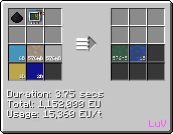
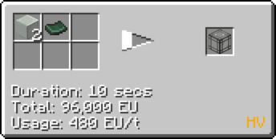

# Polyvinyl Butyral (PVB)
<small>**Guide by:** ME Item Storage Cell</small>

!!! quote ""

A fairly simple <hv>HV</hv> plastic, used only to make greenhouses, useful if you need trees or other crops.

## How to make PVB

### LCR

```mermaid { data-search-exclude }
flowchart LR 
    %%{init: { 'theme': 'neutral', 'themeVariables': { 'edgeLabelBackground': 'transparent', 'secondaryColor': 'transparent', 'tertiaryColor': 'transparent', 'labelBkgBackground' : 'transparent' }}}%%

    A@{ img: "https://start-dev-team.github.io/StarT-Wiki/Chemical-Lines/Plastics/PVB_img/large_chemical_reactor_butraldehyde.png", label: "LCR (HV)", pos: "t", w: 200, h: 200, constraint: "on" }

    B@{ img: "https://start-dev-team.github.io/StarT-Wiki/Chemical-Lines/Plastics/PVB_img/large_chemical_reactor_polyvinyl_butyral.png", label: "LCR (HV)", pos: "t", w: 200, h: 200, constraint: "on" }
    
    C@{ shape: lean-r, label: "1b Propene" }

    D@{ shape: lean-r, label: "1b Carbon Monoxide" }

    E@{ shape: lean-r, label: "2b Hydrogen" }

    F@{ shape: lean-r, label: "576mb PVA" }

    G@{ shape: lean-r, label: "576mb PVB" }

    C --> A
    D --> A
    E --> A
    F --> B
    A --1b Butyraldehyde--> B
    B --> G
```

### Chem Plant

Mostly the same, just more condensed with simpler ingredients.



!!! tip ""
    === "Inputs"
        - Oxygen
        - Acetic Acid
        - Ethylene
        - Propene
        - Hydrogen

    === "Outputs"
        - PVB
        - Water

## Uses of PVB

PVB's only important use if making laminated glass, which is used in Greenhouses.


