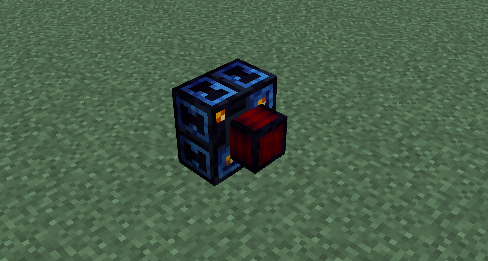
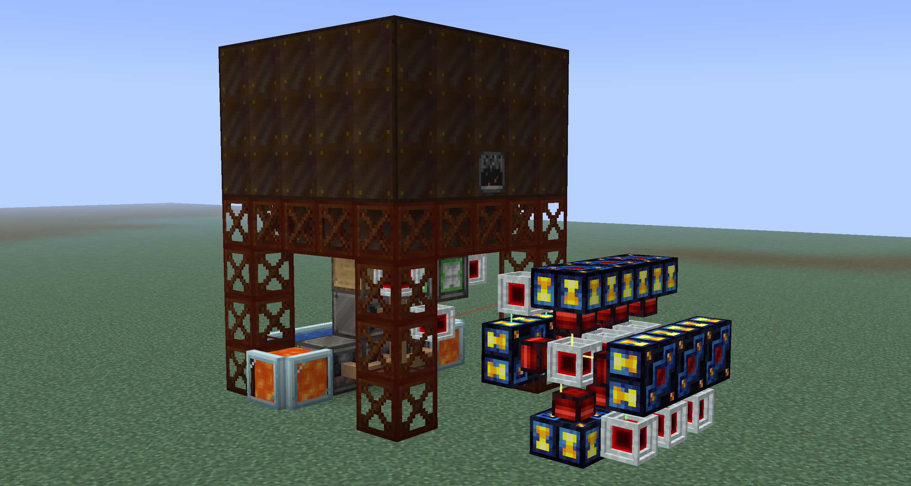
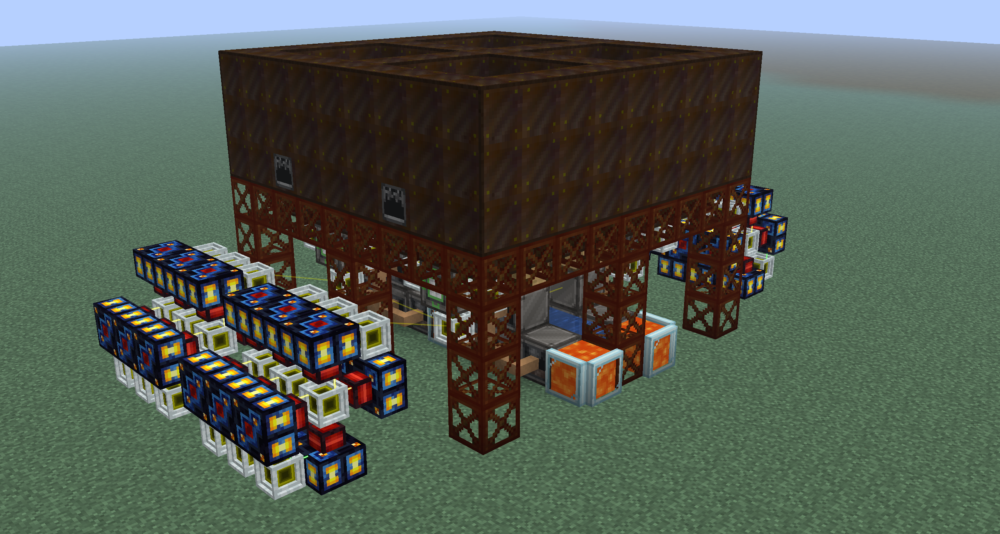

# Dynamos
<small>**Guide by:** humanoferth</small>

Dynamos are a type of block added by Thermal that can generate power. They are often used from <LV>**LV**</LV> to <EV>**EV**</EV> or early <IV>**IV**</IV>. There are 3 types of dynamos:

!!! example ""

    === "Stirling Dynamo"

        Stirling Dynamos use furnace fuel as an input. This is the first dynamo that you can use and are a decent choice for an intial power source.

    === "Compression Dynamo"
        
        Compression Dynamos take fluid fuels as their input. While these can be better then the singleblock turbines from gregtech, they are difficult to set up early on and you have much better options.

    === "Lapidary Dynamo"

        Lapidary Dynamos use gems as an input to generate power. Out of the three dynamo options, these are the best in terms of ease of setup and maximum power output. These are gated by the assembler and require cobalt brass to craft.

I **strongly** recommend you use lapidary dynamos as your primary power source if you want to use dynamos for power. It is much easier to scale then the other two sources and will last you a long time, at least until you get better power sources like Nitrobenzene. To make the initial power required to get the lapidary dynamo, stirling dynamos are an option, though I advise against trying to scale them since they are highly inefficient. I strongly advise against using the compression dynamo since it requires much more infrastructure and processing then the lapidary dynamo does, and by the time you can get fuel for it easily you'll have other options.

## Anatomy of a dynamo

Dynamos only output power on the red piece protruding out. It won't output power on any other ends. Similarly, you can't input items on the red piece protruding out, although there are ways to get around this with LaserIO.

## Calculating Fuel Consumption and FE/t

Without augments, dynamos produce 200 FE/t (4000 FE/s). Fuel consumption can be calculated by dividing the total FE produced by one item (Found in EMI) or bucket of fuel by the FE/s your dynamo is currently producing (factoring in augments). For example, a diamond produces a total of 300,000 FE, as found in EMI. Dividing this by 4000 (FE/s produced by a lapidary dynamo with no augments) gives 1 diamond consumed every 75 seconds. Below are a list of augments and how they effect fuel consumption and power production.

!!! example ""

    === "Upgrade Kits"

        Upgrade kits scale machines they are in by some scale factor. In dynamos, this means that they multiply power production and fuel consumption by that scale factor. If, for example, a lapidary dynamo is being fueled by diamonds (produces 300,000 RF each) had an <EV>**EV**</EV> upgrade kit (48x scale factor), the dynamo would produce 9,600 RF/t (200 RF/t * 48) while consuming a diamond every 1.5625 seconds (300,000 RF / (9,600 RF/t / 20 t/s)). While you can put multiple upgrade kits in a dynamo, only one of the highest tier one will do anything.

        Each tier of upgrade kit will have a scale factor 2x larger then the last, starting at 6 in <LV>**LV**</LV>, 12 in <MV>**LV**</MV>, 24 in <HV>**HV**</HV>, and 48 in <EV>**HEV**</EV>

    === "ARC Kits"
        
        Auxillery Reaction Chamber Kits (ARC's) **additively** increase power output at the cost of a **multiplicative** increase in fuel energy. Its really important to keep in mind that these effects are compounding. If, for example, a lapidary dynamo is being fueled by diamonds (produces 300,000 RF each) had an <EV>**EV**</EV> ARC (.6x fuel energy, +300% power output), the dynamo would produce 800 RF/t (200 RF/t + (300% * 200 RF/t)) and it would consume a diamond every 11.25 seconds ((300,000 RF * .6)/(800 RF/t * 20 t/s)). A dynamo can take multiple ARC's, where fuel energy is multipled, and  power output is added for each ARC. If, for example, a lapidary dynamo is being fueled by diamonds (produces 300,000 RF each) had 3 <EV>**EV**</EV> ARC's (.216x fuel energy (.6 ^ 3), +900% power output (300 * 3)), the dynamo would produce 2000 RF/t (200 RF/t + (900% * 200 RF/t)) and it would consume a diamond every 1.62 seconds ((300,000 RF * .216)/(2000 RF/t * 20 t/s)).

        Each tier of ARC will decrease fuel the fuel energy multiplier by .1 while increasing fuel energy by 100% (except for <LV>**LV**</LV> to <MV>**MV**</MV>, which increases by 50%) starting at .9x fuel energy and +50% in <LV>**LV**</LV>, .8x fuel energy and +100% in <MV>**MV**</MV>, .7x fuel energy and +200% in <HV>**HV**</HV>, and .6x fuel energy and +300% in <EV>**EV**</EV>.

    === "MCI Kits"

        Multi-cycle Injector Kits (MCI's)  **multaplicatively** decrease fuel consumption without affecting power output.  If, for example, a lapidary dynamo is being fueled by diamonds (produces 300,000 RF each) had an <EV>**EV**</EV> MCI (1.6x fuel energy), the dynamo would produce 200 RF/t and it would consume a diamond every 120 seconds ((300,000 RF * 1.6)/(200 RF/t * 20 t/s)). A dynamo can take multiple MCI's, where fuel energy is multipled for each ARC. If, for example, a lapidary dynamo is being fueled by diamonds (produces 300,000 RF each) had 3 <EV>**EV**</EV> ARC's (4.096x fuel energy (1.6 ^ 3)), the dynamo would produce 200 RF/t and it would consume a diamond every 307.2 seconds ((300,000 RF * 4.096)/(2000 RF/t * 20 t/s)).

        Each tier of MCI increases the fuel energy multipler by .15 starting at 1.15x in <LV>**LV**</LV>, 1.3x in <MV>**MV**</MV>, 1.45x in <HV>**HV**</HV>, and 1.6x in <EV>**EV**</EV>.
        
MCI's are better than ARC's since you MCI's just gives fuel more energy at no cost. While ARC's output more power, this increase in power also increases the speed at which fuel is consumed on top of the decrease in fuel. Using the numbers above, a lapidary dynamo with three <EV>**EV**</EV> ARC's would consume a diamond every 1.62 seconds and produce 2000 RF/t. To do the same with lapidary dynamos with three MCI's (which consume a diamond every 307.2 seconds and produces 200 RF/t), you could put down 10 lapidary dynamos with three MCI's and get the same power output (200 RF/t * 10) while consuming a diamond every 30.72 seconds (307.2 s / 10).

To better quantify this, suppose you were producing 1 diamond per second. Using 3 <EV>**EV**</EV> ARC's (as described above) you could at max produce 3,240 FE/t (1 d/s * 1.62 s/d * 2,000 RF/t) while with 3 EV MCI's you could at max produce 61,440 FE/t *(1 d/s * 307.2 s/d * 200 FE/t) given your willing to put down more dynamos.

Optimally, for a dynamo you'll want to have an upgrade kit and three MCI's of the highest tier you can afford in your dynamos. The upgrade kit will increase power output to help reduce dynamo spam while the MCI's will help alleviate the increases in fuel consumption. Using ARC's will just require you to make more fuel much faster due to the compounding effects, which is especially an issue as fuel will later cost energy itself to make.

## Example Lapidary setup

This setup below is incredibly simple but outputs a massive amount of power (445A <LV>**LV**</LV>):

It uses 2 <LV>**LV**</LV> rock crushers, 2 <LV>**LV**</LV> forge hammers, and an <LV>**LV**</LV> mechanical sieve. This makes sand, which is then pushed into a mechanical sieve that generates gems. All of these gems are pushed into 12 lapidary dynamos with an <LV>**LV**</LV> upgrade kit and 3 <LV>**LV**</LV> MCI's. Here is a single module:

It is also slightly positive on fuel to ensure no downtime. This setup can be wallshared on its left, right, and back and can be expanded infinitely to the left and right. Here it is quaded:

If everything is scaled to <MV>**MV**</MV>, it would be able to handle 18 dynamos and would produce 332.5A of <MV>**MV**</MV>. If everything is scaled to <HV>**HV**</HV>, it would be able to handle 26 dynamos and would produce 238.75 of <HV>**HV**</HV>. If everything is scaled to <EV>**EV**</EV>, it would be able to handle 36 dynamos and would produce 163.75A of <EV>**EV**</EV>.

## Calculators and Credits

- This [calculator](https://docs.google.com/spreadsheets/d/1n_muSKYPbVeTxJMGTGKpWlGKDjqaXruxRV3P3R-xkLA/edit?gid=616691493#gid=616691493) can be helpful for doing calculations.
- Be sure to check out c-rad's guide on discord for more.