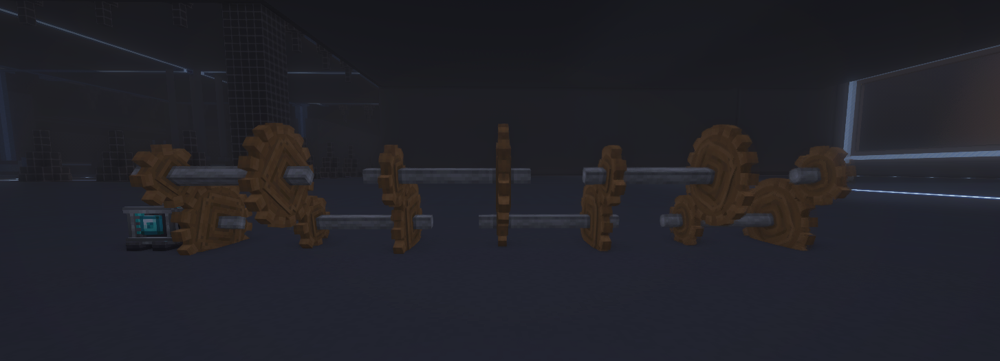
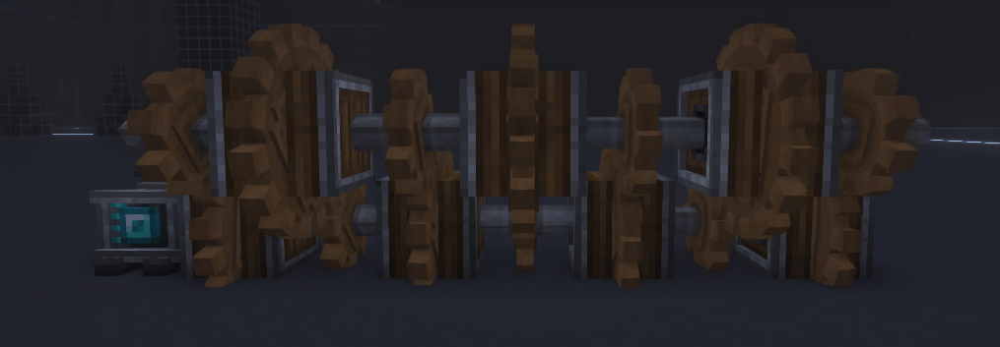

# What is RPM

## The basics

**RPM** is how fast your machines are running. The higher the **RPM** the faster your machines run and the more [**SU**](/docs/Gameplay/Mechanics/Create/Stress%20Units.md) they consume.

## How to increace and decrease it

**RPM** can be increased by using gear ratios and alternating large and small cogwheels.

This is howewer is an inefficent method as it wastes a lot of space. This can be improved with the use of encased cogwheels which removes the need for the shaft between the pairs of cogwheels

