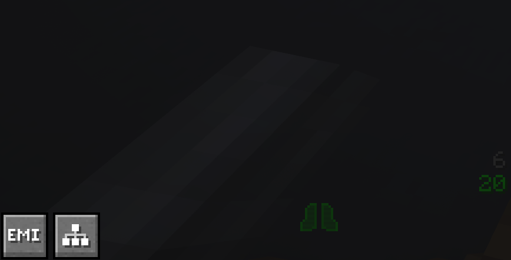

# Recepie Tree

## How to use it

The recepie tree is a great tool. It can be accesed in the lower left corner of your inventory.

If you dont have an active recepie tree you will not see anything other that a random tree. If you wish to use it then you need to open a recepie and click on the recepie tree button on the right.

When you click on it you will see the recepie itself. By itself it is a small tree to expand it you need to click on the ingredients. It will bring up all the recepies for it. You then can decide the recepie you wish to use for it.

To do that you need to click on the output of it. And you will brought back to the screen where you decide the ingredients, and that recepie will be added to it. 

You can scroll to change the amount of outputs and the required item amouts will be adjusted.

It will aslo display the amount of leftovers you will get from it. It will not do any loops, recycling of items or other advancet logic for you.