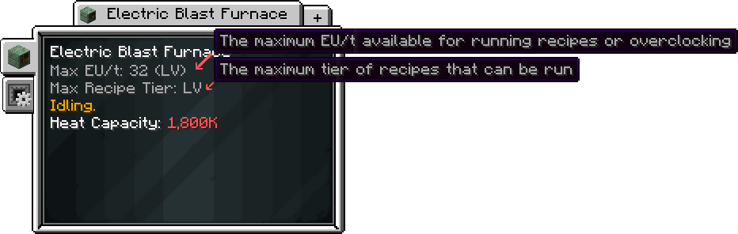

# Overclocking (OC)
<small>**Guide by:** driftbluestone & ME Item Storage Cell</small>

!!! quote ""

Overclocking is an umbrella term for feeding more energy into a machine to make it run faster. There are many types of overclock, each with different properties. 

## Recipe Speed
### (Regular) Overclock (OC)
When a recipe is run at a Speed Tier higher than its base voltage tier, it will be faster. For every tier above the base, the recipe will run 2x faster. As you are using power of a higher voltage tier, the total energy consumption is multiplied by 2 (4x EU/t, but only half the time taken)

!!! example "Example: EBF"

    
    

    As seen here, running this <MV>MV</MV> recipe at <HV>HV</HV> cuts the time in half. We can additionally observe that energy usage is quadrupled (as 1A <HV>HV</HV> = 4A <MV>MV</MV>). Yet since the time is halved it ends up being double the power draw.

### Perfect Overclock (POC)
Some machines have POC, instead of Regular OC. This means that, for every tier above the base, a recipe will run 4x faster while using 4x the energy like normal. It should be noted that POC is an inherent attribute of a multiblock. You cannot force a multiblock to POC, or take away  its POC. the only exception to this is POC where heat is involved.

!!! example "Example: Chem Plant"

    
    

    As the Chem Plant is capable of POC, the recipe time is divide by 4 when going from <IV>IV</IV> to <LuV>LuV</Luv>. The energy usage also quadruples like normal (1A LuV = 4A IV), but the net power draw is still the same, as the recipe is 4 times faster. 

### Semi Perfect Overclock (SPOC)
Increasing the tier or amperage of energy hatches in a fusion reactor doesn’t make it any faster, but upgrading the reactor does. 

### Subtick Parallels
As you progress through the pack, older recipes will continue to get faster and faster. But what happens when it reaches 1 tick? Minecraft does not compute between ticks, and because of that, a machine will no longer speed up if overclocking a recipe means running it faster than 1 tick. 

And thats where Subtick Parallels come in to play. If a machine has the capacity to subtick, and reaches the point where overclocking a recipe means sub-tick speeds, the machine will instead parallel to simulate the effect of overclocking.

!!! example "Example: Industrial Barrel"

    
    
    
    As we can see, the recipe for Sea Water in the Industrial Barrel caps at 0.05 seconds (1 tick) when run at <ZPM>ZPM</ZPM>, and this speed does not decrease further if run at <UV>UV</UV> or higher. Except, in practice, we can notice that the barrel starts to run recipes in parallel.

    
    

    Notice that the barrel is running 2 parallels. If the recipe were to have overclocked, then it would be running every 0.025 seconds, or every half a tick. Multiplying that by 2 gives us the current result, 2 recipes every tick. The barrel has begun to parallel to simulate the effect of overclocking.

## Machine Capability

### Recipe Tier Overclock
Most multiblocks have the ability to accept 2 energy hatches. If these 2 hatches (of the same tier) provide a sufficient amount of amps (4), the multiblock will have the ability to run recipes of a higher recipe tier. A multiblock can only overclock its recipe tier once.

### Speed Tier Overclock
Energy hatches can supply a varying amount of amperes to a machine. Multiamp Hatches can provide up to 16a amps, and Dreamlink Hatches can provide up to 256a. When a multiblock is provided with more than 1 amp, it will try to transform them into an amp of the next tier, and will keep doing this until it cannot. This is speed tier overclocking, and it directly affects how fast a multiblock will run recipes. 

Speed tier overclocking will not affect a machines recipe tier, unless it has two energy hatches of the same tier. The second hatch does not strictly need to be powered, unless they are being shared.

