# Cards

---

## Types

There are four types of Logistic Cards in LaserIO, each with their own use.

!!! abstract "**Card Types**"

    === "{align=center width=25} **Item Card**"

        The Item Card is used to move Items in and out of various inventories, as well as being able to scan inventories for certain items in order to output a redstone signal.

        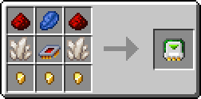{align=center}

    === "{align=center width=25} **Fluid Card**"

        The Fluid Card is used to move fluids in and out of various inventories, as well as being able to scan inventories for certain fluids in order to output a redstone signal.

        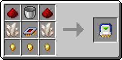{align=center}

    === "{align=center width=25} **Energy Card**"

        The Energy Card is used to move energy in and out of various machines and other energy blocks, as well as being able to read the energy level in order to output a redstone signal.

        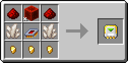{align=center}

    === "{align=center width=25} **Redstone Card**"

        The Redstone Card is a bit more special than the others. It is able to read and transmit redstone signals as well as perform logic operations on those same signals before outputting them. It is also necessary for redstone control on the other Cards.

        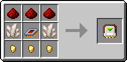{align=center}

## {width=25} Logistic Overclocker

The Item and Fluid Cards have limits on how much they can move in a single operation and how often they operate. Logistic Overclockers can be used to increase the amount moved in one operation and decrease the time between operations.

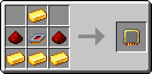{align=center}

You can have up to 4 in a Card and they only affect the Extract, Stock and Sensor modes. The Insert mode is unaffected because it is passive.

---

## Configuration & UI

You can configure a card by either pressing `R-Click` with it in hard, or by pressing `R-Click` on the Card inside the Laser Node UI.

!!! tip
    If you want to return a Card to its default, non-configured state, you can put it inside a crafting grid, which will remove all NBT data from the Card. Filters will also be extracted and left inside the crafting grid.

    Although, Cards are so cheap that you generally just trash them and make new ones instead.

### Common UI Elements

Those elements mostly apply to Item, Fluid and Energy Cards, due to their similarity, but the Redstone Card shares some features as well, mainly the Card Mode and Channel functionality.

The Redstone Card is covered more in depth in its [own section](./Cards.md/#redstone-cards) further down.

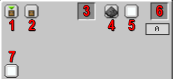{align=center}

1. ^^**Card Mode**^^ - Switches between Insert, Extract, Stock and Sensor for Item/Fluid/Energy Cards. Switches between Input and Output for Redstone Cards.

2. ^^**Directional Config (Sneaky Mode)**^^ - By default, the Card will interact with the side of the block it is pointing at, but it can be changed to any side. For example, you can interact with the bottom of a Furnace even if the Laser Node is on top. Useful for blocks that have sided configs.

3. ^^**Filter Slot**^^ - Only available for the Item and Fluid Cards. Allows the use of various [Filters](./Filters.md). The Counting Filter in particular has slightly different functionality based on mode.

4. ^^**Redstone Mode**^^ - Can be used to control the activity of the Card by using a Redstone Channel. By default it is Ignored (meaning Off).

5. ^^**Redstone Channel**^^ - Does nothing unless combined with Redstone Mode. Read the previous item.

6. ^^**Logistic Overclock Slot**^^ - Special slot for putting in Logistic Overclockers. Only available for Item and Fluid Cards.

7. ^^**Channel**^^ - You can group together cards by Channel (**NOT the same thing as Redstone Channel!!!**). Cards from different channels will not interact even if on the same network.

!!! info "**Energy Card**"

    As you can see, the Energy Card is very similar to the Item and Fluid Cards.

    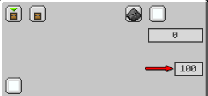{align=center}

    It differs a bit because it cannot be Overclocked or filtered.
    
    Instead of the Filter it gets an **Energy Limit** setting which can be used to set a percentage that controls the card based on how full (of energy) is the target. It does different things based on the mode.  Can be adjusted by clicking.

### Modes

You can switch between modes with the top-left most button.

!!! info
    - The Item and Fluid Cards share the same operation modes and configs so they will be covered together.
    - The Energy Card is slightly different from the last two, but still very similar so it will receive special mention only where necessary.
    - The Redstone Card is completely different and has its own section.

#### Item/Fluid/Energy Cards

Insert, Extract, Stock and Sensor modes for the Item, Fluid and Energy Cards:

!!! abstract "**Card Modes**"

    === "**Insert**"

        Since Insert Cards are passive, the functionality of the Insert mode changes based on how other Cards on the network interact with them.

        - **Extract** - Pushes into Insert Cards.
        - **Stock** - Pulls from Insert Cards.

        | Item / Fluid | Energy |
        | :----------: | :----: |
        | 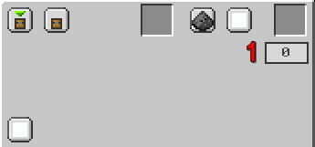{align=center} | 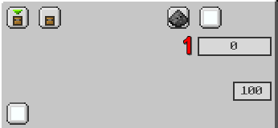{align=center} |

        1. ^^**Priority**^^ - If multiple cards on the network can be used at the same time, which one to pick. Higher Priority means it gets to go first.

        !!! info "Energy Limit"

            For Insertion, the Energy Limit setting on the Energy Card dictates how much it should fill the target when inputting energy from an Extract Card, or how much to drain the target when pulling energy for a Stocking Card.

        !!! info "Counting Filter"

            The Counting Filter tells the Insert Card how much to keep inside the target, weather when pushing inside or pulling out.

    === "**Extract**"

        The Extract Card pulls Items/Fluids/Energy out of the target block.
        
        | Item / Fluid | Energy |
        | :----------: | :----: |
        | 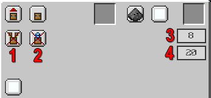{align=center} | 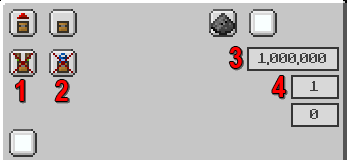{align=center} |

        1. ^^**Round Robin**^^ - Makes it so it tries to rotate through Insert Cards when pushing stuff. Enforced makes it stop until it can insert into the next card, forcing it to spread equally. Off by default.

        2. ^^**Exact Mode**^^ - Forces it to wait until it can do a full Transfer Amount or a full Counting Filter limit, whichever is smaller. Off by default.

        3. ^^**Transfer Amount**^^ - How much to try to extract from the target in a single operation. Can be adjusted by clicking. Logistic Overclockers increase the maximum.

        4. ^^**Speed (Ticks)**^^ - How long to wait between operations (less means it goes faster). Can be adjusted by clicking. Logistic Overclockers decrease the minimum.

        Both Transfer Amount and Speed are maxed out by default for Energy Cards.

        !!! info "Energy Limit"

            For Extraction, the Energy Limit setting on the Energy Card dictates how much it should leave inside the target it's pulling from.

        !!! info "Counting Filter"

            The Counting Filter tells the Extract Card how much to leave inside the target when pulling.

    === "**Stock**"

        The Stock Card performs operations using Filters, interacting with Insert Cards on the same network. The exact functionality changes based on configuration.
        
        | Item / Fluid | Energy |
        | :----------: | :----: |
        | 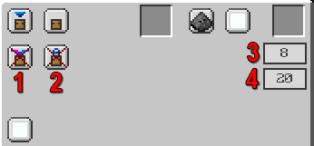{align=center} | 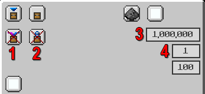{align=center} |

        1. ^^**Regulate**^^ - Only works with a Counting Filter, otherwise it does nothing. If the number of items/fluids inside the target exceed the Counting Filter limit, they will be pulled out and sent to valid Insert Cards, similar to how an Extract Card would work. Off by default.

        2. ^^**Exact**^^ - Forces it to wait until it can do a full Transfer Amount or a full Counting Filter limit, whichever is smaller. Off by default.

        3. ^^**Transfer Amount**^^ - How much to try to extract from the target in a single operation. Can be adjusted by clicking. Logistic Overclockers increase the maximum.

        4. ^^**Speed (Ticks)**^^ - How long to wait between operations (less means it goes faster). Can be adjusted by clicking. Logistic Overclockers decrease the minimum.

        Both Transfer Amount and Speed are maxed out by default for Energy Cards.

        !!! warning

            The Stock mode for Item/Fluid Cards NEEDS a filter and only works with a filter in allow mode.

        !!! info "Energy Limit"

            For Stock, the Energy Limit setting on the Energy Card dictates how much it should fill the target. If the target exceeds the Energy Limit, it will instead start pulling energy and sending it to Insert Cards.

        !!! info "Counting Filter"

            The Counting Filter tells the Stock Card how much to keep inside the target when pushing. It also has the special interaction with Regulate mentioned before.

    === "**Sensor**"

        The Sensor Card checks the target block and compares it against its filter, generating a redstone signal based on the result.
        
        | Item / Fluid | Energy |
        | :----------: | :----: |
        | 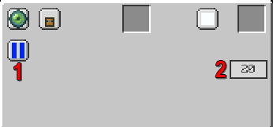{align=center} | 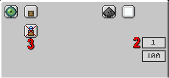{align=center} |

        1. ^^**Logic Operation**^^ - Wether to perform OR/AND on the filters. Only available on Item/Fluid Cards.

        2. ^^**Speed (Ticks)**^^ - How long to wait between operations (less means it goes faster). Can be adjusted by clicking. Logistic Overclockers decrease the minimum.

        3. ^^**Exact**^^ - Untested functionality, unknown what exactly it does. Only available on Energy Cards. Off by default.

        Speed is maxed out by default for Energy Cards.

        !!! warning

            The Sensor mode for Item/Fluid Cards NEEDS a filter because otherwise it has nothing to check against.

        !!! warning "Energy Limit"

            Untested functionality, unknown what exactly it does.

        !!! info "Redstone Channel"

            Sensor mode acts more like a Redstone Card. It only features a Redstone Channel option because the output is a redstone signal, which will go to that specific channel.

#### Redstone Cards

The Redstone Card function differently and uniquely compared to the other three.

!!! abstract "**Card Modes**"

    === "**Input**"

        Reads the redstone level from the target and sends it to the selected Redstone Channel.

        | Interval OFF | Interval ON |
        | :----------: | :----: |
        | 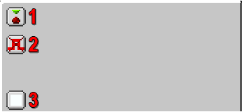{align=center} | 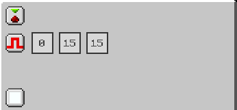{align=center} |

        1. ^^**Card Mode**^^ - Same as with the other three cards, changes between the two modes.

        2. ^^**Interval**^^ - Checks the redstone level against a lower bound (1st box) and an upper bound (2nd box), outputting the selected strength (3rd box) into the Redstone Channel if the redstone signal from the target block in between the bounds.

        3. ^^**Redstone Channel**^^ - Replaces the regular Channel from the other three Cards. Used to group together the Cards.

        !!! tip "Advanced Comparator"

            The Input mode can be used as a compact, and more advanced, Comparator by using the Interval. By adjusting the upper and lower bounds you can get it to work as a `greater than`, `smaller than` or `equal to` operator (as well as their combinations).

    === "**Output**"

        Outputs the redstone level from the selected Redstone Channel to the target.
        
        | Logic OFF | Logic ON |
        | :----------: | :----: |
        | 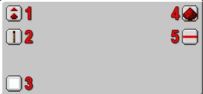{align=center} | 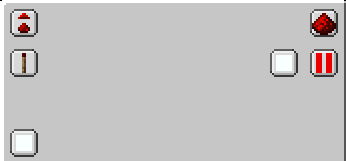{align=center} |

        1. ^^**Card Mode**^^ - Same as with the other three cards, changes between the two modes.

        2. ^^**Weak/Strong Signal**^^ - What level signal to output. Weak means whatever is coming in, Strong is always 15.

        3. ^^**Redstone Channel**^^ - Replaces the regular Channel from the other three Cards. Used to group together the Cards.

        4. ^^**Redstone Operation**^^ - Off by default. Can perform a NOT or Complementary operation on the redstone signal. Complementary means it flips the strength on the 0-15 scale.

        5. ^^**Logic Operation**^^ - Off by default. If turned on, you have the option to select a second Redstone Channel to perform a logic operation together with. Available operators are: OR, AND, XOR.

By combining the two modes, you can perform quite advanced redstone functions without the need for additional, external tools.