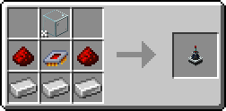
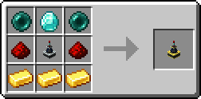
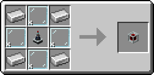
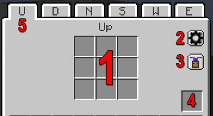
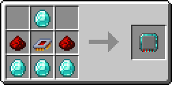

# Connectors & Nodes

---

## {width=25}Laser Connectors

Connectors have the role of carrying connections across longer distances.

{align=center}

Laser Connectors don't have any function besides connecting to other parts. They have the same connection distance as a Node and are mostly used to traverse longer distances without needing to use Nodes in-between. They act as a sort of "wire pole" for the network.

### {width=25} Advanced Laser Connector

There is also an Advanced Laser Connector, which functions somewhat similarly to the normal Laser Connector, with a few key differences.

{align=center}

The Advanced Laser Connectors have no range limit and even work across dimensions. They can only be connected one-to-one, meaning you can't connect one Advanced Laser Connector to more than one other Advanced Laser Connector. They can still connect to as many other Nodes and basic Laser Connectors as you want, but only withing the 8 block range.

When two Advanced Laser Connectors are linked, their laser line will point up (relative to the way it is facing) into a small, dark cube. If looking at a linked Advanced Laser Connector while holding the Laser Wrench, you will be able see the coordinates of the other Advanced Laser Connector near the center of the screen.

---

## {width=25} Laser Node

Laser Nodes are the main part of a LaserIO network. They connect to other Nodes and Connectors, sharing this functionality with Laser Connectors, while also being able to perform all the logistic functions via [Cards](../LaserIO/Cards.md).

{align=center}

### Node UI

If you open a Laser Node, you will be greeted with this UI:

{align=center}

1. ^^**Card Inventory Grid**^^ - Where you will place your Cards.

2. ^^**Network Settings**^^ - A tab for customizing the colors of the laser network the node is part of. It will change the colors of the entire network at once. Purely visual, has no practical function.

3. ^^**Show Particles**^^ - Toggle the particle effects that happen when a Card does something. Purely visual but it can cause lag if theres too many, so turning them off may be preferred.

4. ^^**Node Overclocker Slot**^^ - Special slot for putting in Node Overclockers.

5. ^^**Side Tabs**^^ - Each side of a Laser Node has it's own Card Inventory Grid, with the tabs at the top letting you switch between all of them without needing to open the exact face in world.

### {width=25} Node Overclocker

For any side of a Laser Node, only one card can run at a time. If you have multiple Cards per side, you will want to use Node Overclock Cards.

{align=center}

You can add up to 8 Node Overclocks to a Node, each additional card allowing one more Card to function in parallel. The Node Overclock Cards are shared across all the sides of the Laser Node.