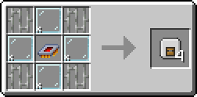
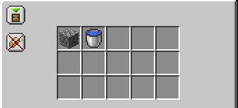
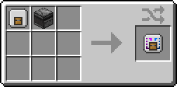
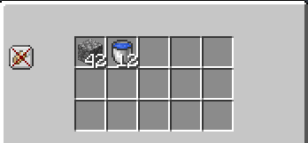
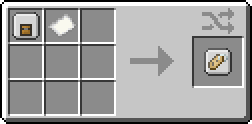
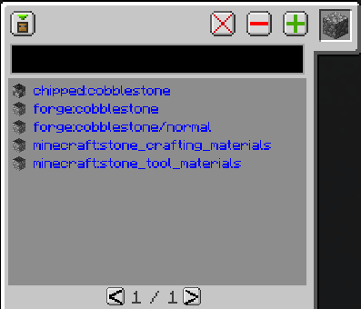
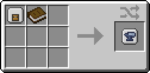
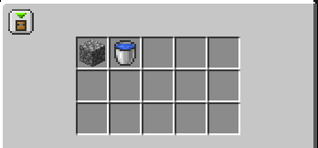
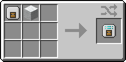
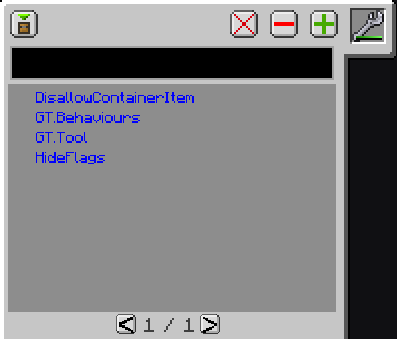

# Filters

---

Filters are used inside the filter slot of Cards, which is only available to Item and Fluid Cards. There are five types: Basic, Counting, Tag, Mod and NBT.

## Configuring Filters

You can configure a Filter by either pressing `R-Click` with it in hand, or by placing it inside a Card, which will open the Filter UI in the middle of the Card UI for the Basic, Counting and Mod Filters. For the Tag and NBT Filters, you can open their UI by pressing `R-Click` on them in the Card UI, which will open their dedicated config UI (this can be done with the first three as well, but isn't needed).

!!! tip

    If you want to wipe the data from any Filter, you can put it inside a crafting grid, which will remove all NBT data from it.

    Although, Filters are so cheap you generally just trash them and make new ones instead.

## Types

!!! abstract "Filter Types"

    === "{align=center width=25} Basic Filter"

        {align=center}

        The Basic Filter allows the filtering of specific items and fluids by placing them in its grid.
        
        {align=center}

        You can add items/fluids from your inventory, or drag them from the EMI tab. Fluids are added as their bucket variant, but they work as the fluid inside Fluid Cards.

        Top left option buttons:

        - ^^**Allow/Deny**^^ - Whitelist or Blacklist mode. Allow by default.

        - ^^**Match NBT**^^ - Whether to check the NBT as well when matching Items/Fluids. Off by default.

    === "{align=center width=25} Counting Filter"

        {align=center}

        The Counting Filter has the same functionality as the Basic Filter, allowing the filtering of specific items and fluids, but also has the ability to set specific amounts. The exact effect the Counting Filter changes based on the mode of the Card and is outlined on the [Cards](./Cards.md/#modes) page.

        {align=center}

        You can add items/fluids from your inventory, or drag them from the EMI tab. Fluids are added as their bucket variant, but they work as the fluid inside Fluid Cards. You can increase the count by using `L-Click` and decrease it by using `R-Click`. If you hold `Shift` while clicking it will increment by 10, and if you hold `Ctrl` it will increment by 64.

        Top left option buttons:

        - ^^**Match NBT**^^ - Whether to check the NBT as well when matching Items/Fluids. Off by default.

    === "{align=center width=25} Tag Filter"

        {align=center}

        The Tag Filter allows filtering based on tags. If you would like to view tags without using the Tag Filter, you can press `F3 + H` to turn on Advanced Tooltips in game. EMI sometimes also shows common tags in the "Usage" screen if you turn the pages all the way to the end.

        {align=center}

        To add tags, you can write them directly in the black box at the top and press `Enter`. You can also place something in the top-right slot, it will then display a list of tags specific to that item/fluid.

        You can click a tag in the list and then press the green, `+` (plus) button to add it, it will then switch from blue to grey. You can remove an added filter by selecting it and pressing the red `-` (minus) button. The large `X` button is used to wipe all settings, removing all filtered tags.

        Top left option buttons:

        - ^^**Allow/Deny**^^ - Whitelist or Blacklist mode. Allow by default.

    === "{align=center width=25} Mod Filter"

        {align=center}

        The Mod Filter allows filtering based on mod that the item/fluid came from. It works similarly to the Basic Filter, but instead of matching the exact item/fluid, it matches the entire mod that it came from.

        For example, simply adding cobblestone would match all of Vanilla Minecraft. Adding anything from GT would match the entirety of GT.

        {align=center}

        You can add items/fluids from your inventory, or drag them from the EMI tab. Fluids are added as their bucket variant, but they work as the fluid inside Fluid Cards.

        Top left option buttons:

        - ^^**Allow/Deny**^^ - Whitelist or Blacklist mode. Allow by default.

    === "{align=center width=25} NBT Filter"

        {align=center}

        The NBT Filter allows filtering based on the NBT values of the item/fluid (although fluids should never have NBT). This filter is very niche and doesn't see much use due to it lacking in functionality.
        
        For NBT filtering it is advised that you instead look towards Pipez, which has a much better NBT filtering method.

        {align=center}

        The UI is very similar to that of the Tag Filter and works much the same way. To add NBT, you place something in the top-right slot, it will then display a list of NBT values specific to that item/fluid. You could also write the NBT key in the black box at the top and press `Enter` to add it, but this is hardly useful.

        You can click a key in the NBT list and then press the green `+` (plus) button to add it, it will then switch from blue to grey. You can remove an added filter by selecting it and pressing the red `-` (minus) button. The large `X` button is used to wipe all settings, removing all filtered NBT keys.

        When hovering over an NBT key in the list it will also display its value, but this is misleading. It only matches the NBT key, and not it's value, which is wh

        Top left option buttons:

        - ^^**Allow/Deny**^^ - Whitelist or Blacklist mode. Allow by default.
