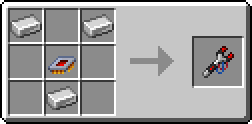
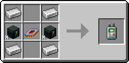
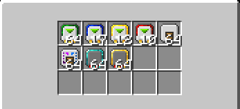
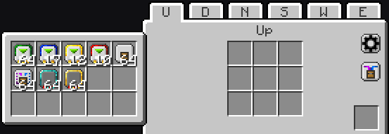
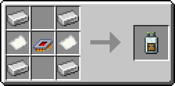

# Tools

---

## {width=25} Laser Wrench

The Laser Wrench is used for setting up connections between LaserIO parts, such as Connectors and Nodes, as well as having a few other minor functions. It is the primary tool you will be using when interacting with the mod. It also has `forge:wrench` functionality, meaning it can interact with some other mods that use wrenches.

{align=center}

### How to use the Laser Wrench

To use the Laser Wrench you need to `Sneak + R-Click` a Node or Connector (it will turn green to show it is selected) and then `R-Click` another Node or Connector to connect them. A line will appear between them to show that they are linked.

One part can be connected to as many other parts as you want, provided they are all within range.

The maximum connection range is 8 blocks, including the parts themselves, meaning there can be at most 6 blocks between any two parts. This range is a sphere and not a cube, so it will be shorter when going diagonally.

!!! info "Fast Chaining"

    The Laser Wrench can also be used from the offhand, in which case it will auto-select the last placed Node or Connector, including any you place with the wrench in hand, allowing parts to be quickly chained together.

---

## {width=25} Card Holder

{align=center}

The Card Holder is used as a bag for LaserIO related items. This includes: Cards, Filters and Overclockers.

Most notably, it allows Cards to stack up to 64 instead of the usual single item stacks. Although, for Cards and Filters to stack they need to have the same NBT values, meaning they will not stack if they aren't configured the exact same way.

It is generally used to hold freshly crafted items, since those will stack up naturally.

### How to use the Card Holder

You can open it by pressing `R-Click` with it in hand.

{align=center}

It will also open inside the Laser Node UI as a side panel if you have it in your inventory, allowing you to pull cards directly out of it and place them inside the Node.

{align=center}

!!! info "Auto Pulling"

    You can also `Sneak + R-Click` with the Card Holder in hand, which will toggle Auto Pulling.
    
    Auto Pulling makes the Card Holder automatically pick up any LaserIO Cards, Filters and Overclockers that enter your inventory, moving them inside itself.
    
    Helpful for keeping your inventory clean while working.

## {width=25} Card Cloner

{align=center}

The Card Cloner is used to copy the settings of one Card to another. It can also be used to copy the setting and contents of Laser Nodes.

### How to use the Card Cloner

!!! abstract ""

    === "{align=center width=25} **On Cards**"

        When cloning Cards, the Card Cloner only works inside the Laser Node Card Grid.
        
        To copy a Card take the Card Holder in your cursor and `L-Click` the Card you want to copy from inside the Node Grid. You will hear a "write" sound if it got copied.

        To paste the settings, simply `R-Click` another Card inside the Node Grid with the Card Holder. You will hear an "enchant" sound if it got pasted.

        This will copy everything from the Card, including: Modes, Settings and Filters.

        !!! info "Filters & Overclockers"

            When cloning Cards, the Card Cloner will attempt to insert Logistic Overclockers and Filters, as well as configure the Filters. It will take them from your inventory or the Card Holder and insert them into the Card.
    

    === "{align=center width=25} **On Nodes**"

        To clone a Node, you must first select one. You can do this by `Sneak + R-Click` a Laser Node in the world with the Card Cloner. The selected Node will have a light blue overlay and you will hear a "write" sound.
        
        You can then paste the settings/contents of the selected Node on another Laser Node by `R-Click` it with the Card Cloner. You will hear an "enchant" sound if it got pasted.

        When cloning Nodes, there are two modes. You can switch between them by pressing `R-Click` in the air with the Card Holder.

        1. ^^**Node Contents**^^ - This mode copies the Card grid inside the Node UI, as well as the Node Overclocker count. This will copy Cards and all of their configs and contents, including Filters and Logistic Overclockers, similar to how it functions on Cards. It will try to pull everything it needs from your inventory or from the Card Holder.

        2. ^^**Network Settings**^^ - Simply copies the config from the Network Settings (the black gear icon on the right) of the Laser Node. Network Settings are purely visual.

You can check what the Card Cloner currently has copied by holding `Ctrl` when hovering over it inside your inventory.

You can clear the data of a Card Cloner by `Sneak + R-Click` with it in the air.

