# LaserIO
<small>**Guide by:** Elon-chan</small>

---

LaserIO is a powerful, early game, logistic mod. It is capable of moving items, fluids, energy and redstone signals wirelessly, at decently high rates.

It is only gated by the acquisition of Gold, most of it's parts requiring Gold Nuggets. Gold can be acquired early game from Copper and Magnetite (obtainable from Sieving Gravel) by using Bulk Washing from **Create** or Centrifugation from **Create:Vintage**.

If you prefer a video guide on LaserIO, direwolf20 has a full guide with timestamps on YouTube:
- [Mod Spotlight LaserIO - by direwolf20](https://youtu.be/o22Pq9NmTSY?si=hx5kkEpN8iFMnuXO)

---

## Getting Started

To start, you will want to make a few Logic Chips by smelting Raw Logic Chips. Those are used in everything LaserIO related, so you will want a good supply of them.

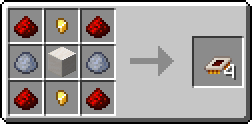{align=center} 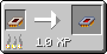{align=center}

The first thing you will want to craft is a [Laser Wrench](../LaserIO/Laser-Wrench.md).

---

## Quick Example Setup

If you don't care to learn all the intricacies of LaserIO, here is a quick tutorial on how to move Cobblestone from an Igneous Extruder to a Drawer.

- ^^**Step 1**^^ - Place one Laser Node on the Igneous Extruder and one on the Drawer. The side you place the Nodes on doesn't matter, in this case we are using the top.

    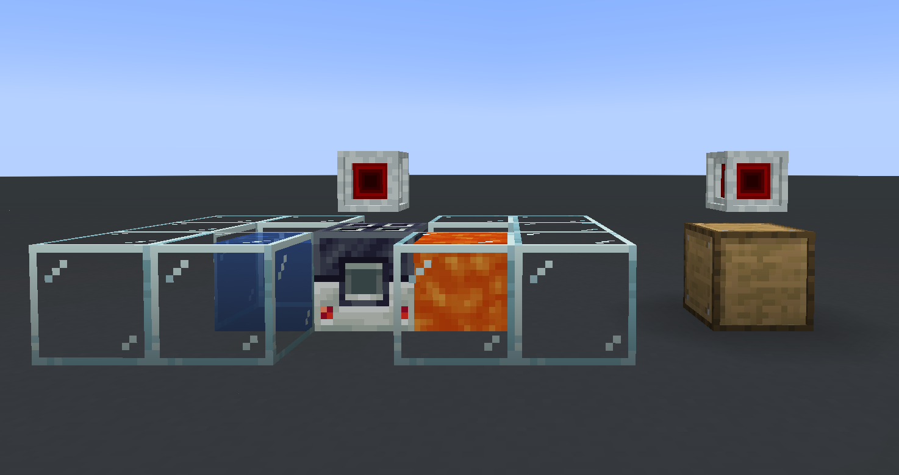{align=center width=350}

- ^^**Step 2**^^ - Open the Laser Node above the Igneous Extruder, making sure you are on the correct side tab. The tabs on top will show the block the specific face is pointing at, open the one that shows the Igneous Extruder (down in our case) and place an Item Card inside.

    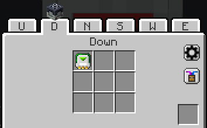{align=center width=350}

- ^^**Step 3**^^ - `R-Click` the Item Card inside the Node UI to open the config screen. Use the top-left-most button to switch the card to Extract mode.

    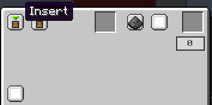{align=center width=350} 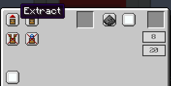{align=center}

- ^^**Step 4**^^ - Now go to the Laser Node above the Drawer (make sure to select the correct side the same way as with the Igneous Extruder) and place an Item Card inside. This will not need to be configured as Cards are Insert mode by default.

    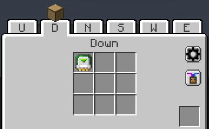{align=center width=350}

- ^^**Step 5**^^ - Take your Laser Wrench and `Sneak + R-Click` one of the Nodes. It will turn green to show that it is selected. Then head over to the other Node and `R-Click` it. You will see a red line form between the Nodes. Some particle effects will appear on the Card connections above the blocks when items get moved.

    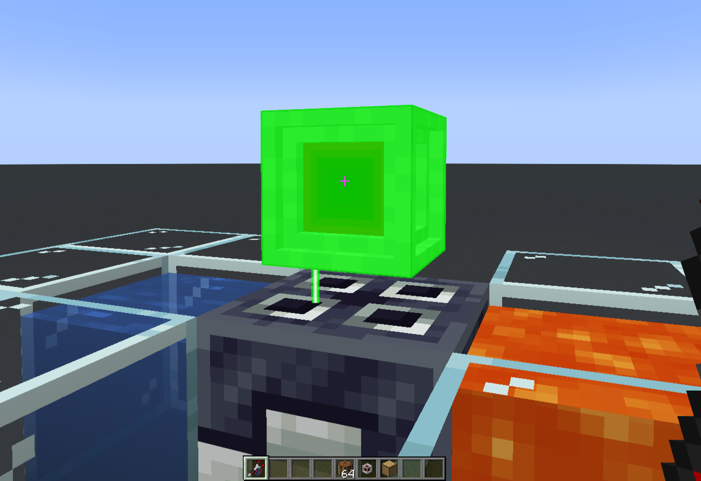{align=center width=350} 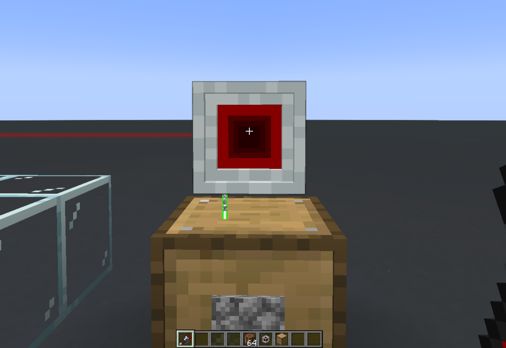{align=center width=350}

Congratulations! You now have a simple LaserIO system that moves Cobblestone from an Igneous Extruder into a Drawer.

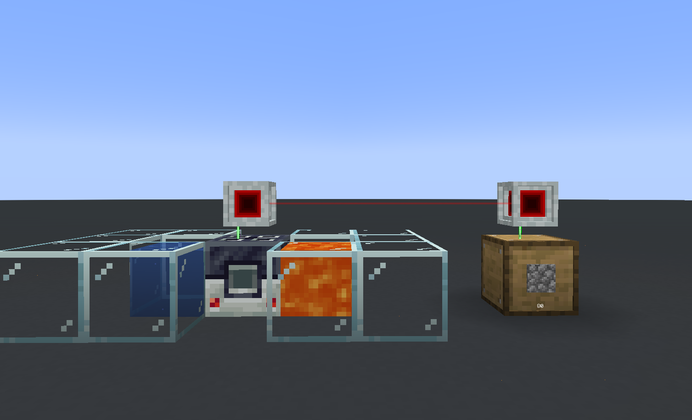{align=center width=500}

Alternatively, you could do it with a single Laser Node by placing both the Igneous Extruder and the Drawer next to the same Node, since all sides work individually.

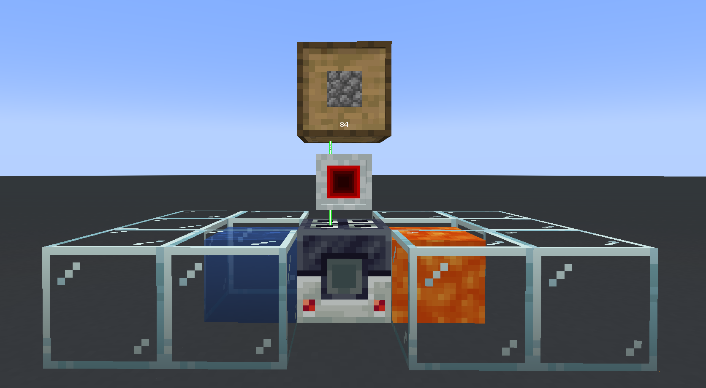{align=center width=500}

!!! info "Speed"

    If you want to speed things up, you can place [Logistic Overclockers](./Cards.md/#logistic-overclocker) inside the Extract Card (the one on the Igneous Extruder) to make it work faster.

This guide should allow you to understand the mod at a basic level. If you need additional info or you are curious about some of the advanced features of the mod, you can check the other pages on LaserIO.