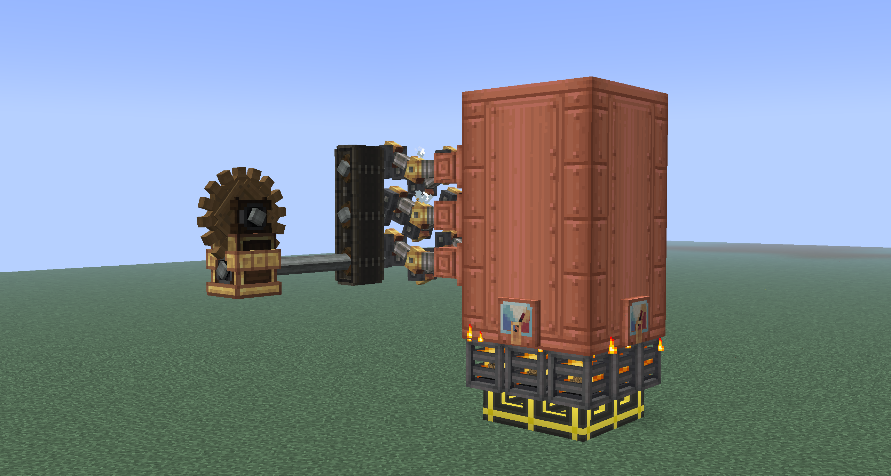
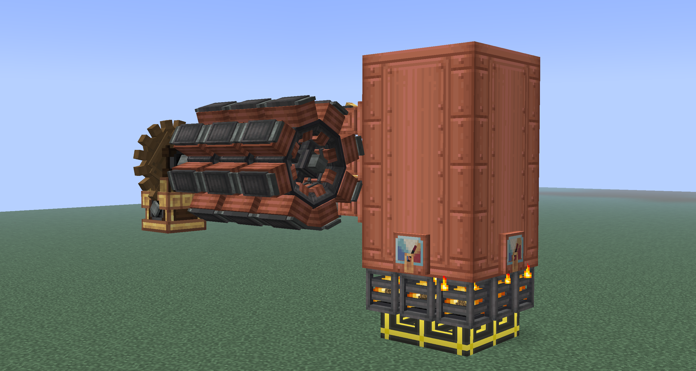
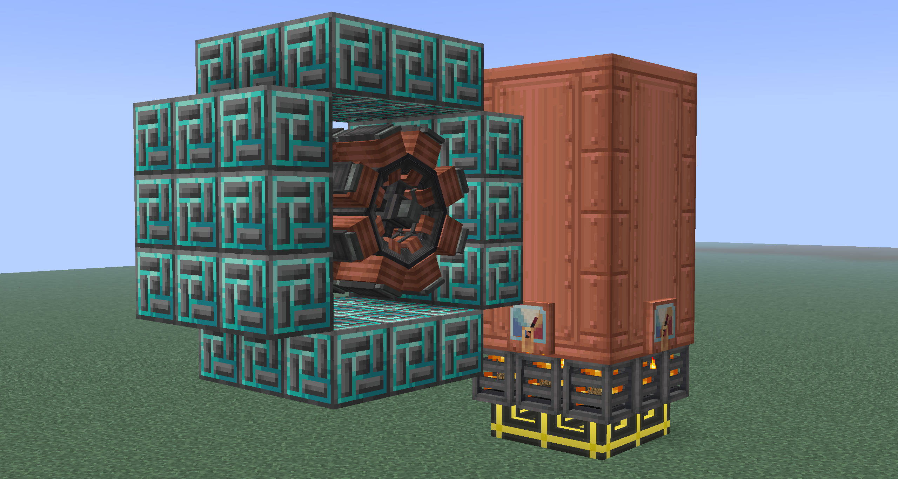
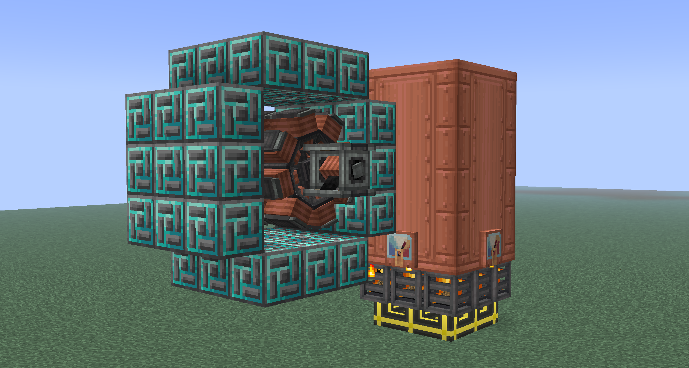
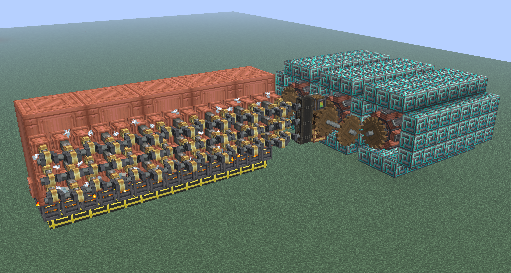
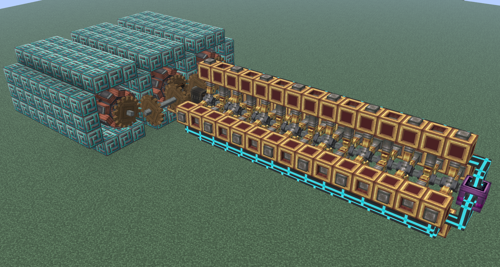

# Create Energy Production

Create can be used early on to generate power by converting stress to power. It is often used from <LV>LV</LV> to <HV>HV</EV> or early <EV>EV</EV> depending on your power needs. <!-- Link back to other articles on create stress gen and over article-->

## Generator Construction

A generator is constructed using generator coils, carbon brushes, and magnets from Create: New Age. The steps to construct a generator is as follows:

1. Have some source of SU prepared. For this example, I'll be using a steam engine to make SU and upping the speed of the output shaft to 256 RPM with a rotation speed controller.

2. Place generator coils in a line, connected by the central shaft running through them. Coils can be placed vertically or horizontally. In this example I'll be placing 3 of them down horizontally.

3. Surround the generator coils with magnet blocks of your choice. For this example I'll be using a total of 36 fluxuated magnetite. Each generator coil can support a total of 12 magnets placed in the circular pattern pictured below.

4. Place a carbon brush on either end of the line of generator coils. Power can be pulled from this carbon brush itself via any source of FE transport (Create: New Age wires, LaserIO, Flux Networks, etc.).

## Magnet Types

There are five tiers of magnets that generator coils can use, and they are as follows:

| Name | Magnetic Force |
|---|---|
| Magnetite Block | 1 |
| Redstone Magnet | 2 |
| Layered Magnet | 4 |
| Fluxuated Magnetite | 8 |
| Large Neodymium Magnet | 24 |

The magnetite block and redstone magnet can be made without power. The layered magnet and fluxuated magnetite require power to make. The large neodymium magnet requires <MV>**MV**</MV> machines to make.

## Calculating SU consumption and FE/t

The magnetic force represents how much SU each magnet adds per RPM. For a generator coil spinning at 128 RPM, each magnetite block around it would consume 128 SU, each redstone magnet would consume 256 RPM, etc. The generator coil itself consumes 24 times the RPM its spinning at. For a generator coil spinning at 128 RPM with no magnets around it, it would consume 3,072 SU. A generator coil spinning at 128 RPM (3,072 SU) surrounded fully by 12 layered magnetite (each with a magnetic force of 4, total of 6144 SU) would consume 9216 SU. When looking at a generator coil with engineer's goggles, it will tell you how much SU it and its surrounding magnets are consuming.

The FE generated per tick per magnet is RPM times magnet power over 20, rounded down. For the example described previously, there are a total of 12 magnets at a magnet power of 4 at 128 RPM. Multiplying these three values together and dividing by twenty yields a total of 307.2, and when rounding down the final FE/t of 307. When looking at a carbon brush with engineer's goggles, it will tell you how much FE/t it is generating.

Using the example shown in generator construction, there are a total of 3 generator coils spinning at 256 RPM (24 times 3 times 256) consuming a total of 18,432 SU. There are also 36 fluxuated magnetite (magnetic force of 8) surrounding these coils (36 times 8 times 256) consuming a total of 73,728 SU. Adding these two together, the total SU consumed is 92,160 SU. Taking the total amount of SU consumed by the magnets, dividing by 20 and rounding down, yields a total of 3,686 FE/t. 

## Notes and Tips

- Carbon brushes can handle a maximum of eight coils that aren't being handled by another carbon brush. For example, if a generator is eight generator coils long and carbon brushes are placed at each end, only one of the carbon brushes will work while the other will not, if the generator is nine generator coils long and carbon brushes are placed at each end, one carbon brush will produce power from eight of the coils while the other will produce power from one coil.
- Magnet can be wall shared. This means that generators can use the same set of magnets to save resources.
- It's important to try your best to use the best magnet available to you since you'll waste SU if you don't. Suppose you had two coils surrounded by magnetite blocks as compared to one coil surrounded by redstone magnets. While the magnets consume the same SU, the generator using magnetite blocks consumes more SU since it has more generator coils.
- Similar to the last point, it's also a good idea to boost the RPM as high as possible. While it doesn't necessarily make SU consumption more efficient like better magnets, it can allow you to build less magnets and coils which can save on resources.
- When you unlock Neodymium magnets, they aren't really worth replacing your fluxuated magnetite with them. Fluxuated magnetite is plenty efficient.

## Example setups

!!! example ""

    === "Steam Engines"

        Steam engines require some kind of furnace fuel input into the basic burners and water input into the steam engines. This setup uses 5 level 9 steam engines and consumes 45 seconds of fuel per second (3 planks per second).

        

        This setup is SU neutral (100% of the SU produced is consumed by the generators). It produces a total of 29491 FE/t by spinning 3 generators with 8 coils fully surrounded by fluxuated magnetite.

    === "Diesel Engines"

        Diesel engines require a liquid from Create: Diesel Generators (Ethanol, Plant Oil, or Crude Biodiesel) and water input into the steam engines. This setup uses 60 huge diesel engines and consumes 60 crude bio diesel per second.

        

       This setup is SU neutral (100% of the SU produced is consumed by the generators). It produces a total of 29491 FE/t by spinning 3 generators with 8 coils fully surrounded by fluxuated magnetite.

