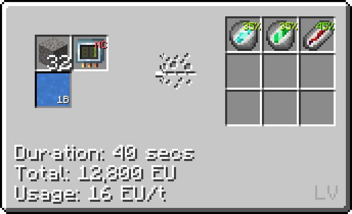
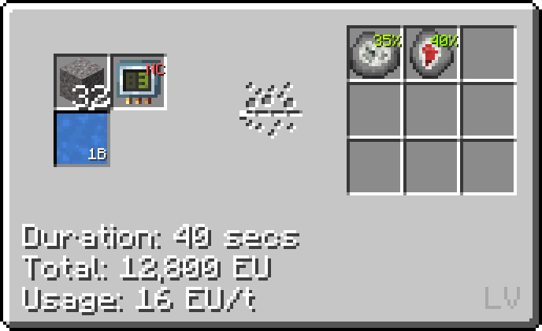
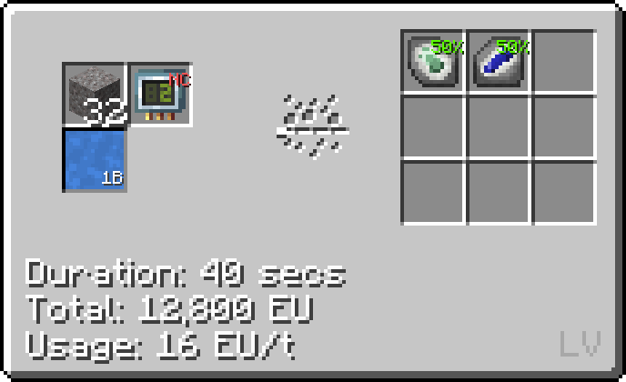
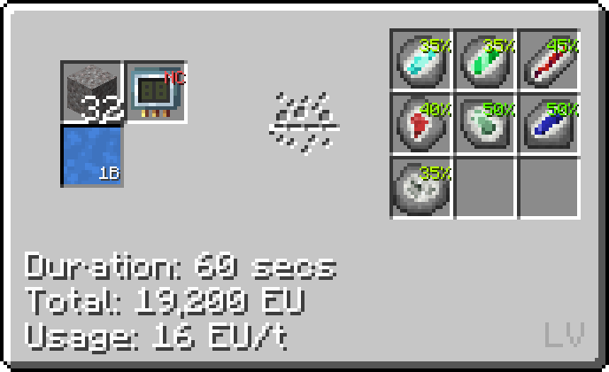
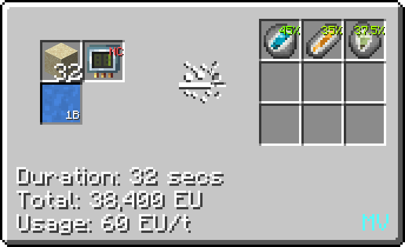
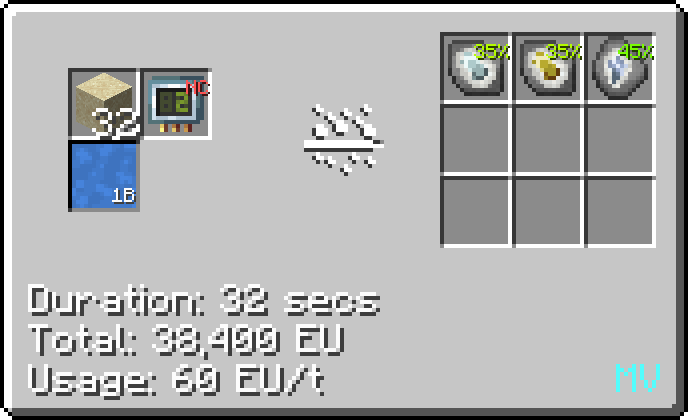
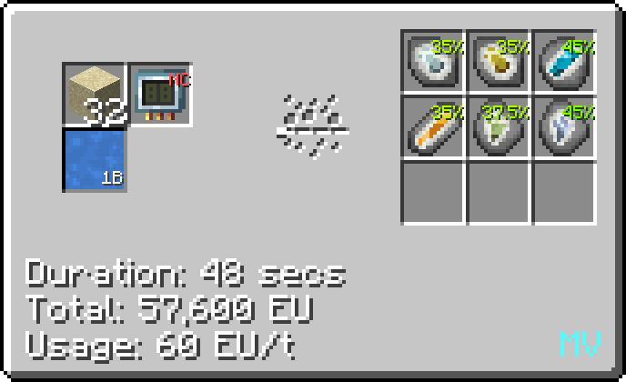
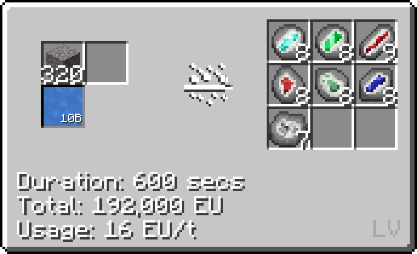
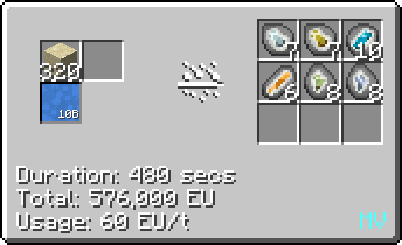

# Geode Filtration
<small>**Guide by:** Jkj3000</small>

!!! quote ""

Rock filtration is the only way to get **geodes** which are used to get rarer resources such as **phosphorus**, **certus quartz**, **monazite** and so on.

The **Rock Filtrator** has two types of recipes <LV>**LV**</LV> and <MV>**MV**</MV>. The <LV>**LV**</LV> recipes take gravel and the <MV>**MV**</MV> take sand. Both of them take **distilled water** as the second input.

!!! abstract "LV Geodes"

    === "**Diamond + Emerald + Ruby**"
        

    === "**Quartzite + Realgar**"
        
    
    === "**Sapphire**"
        

    === "**All LV Geodes**"
        
    
!!! abstract "MV Geodes"
    
    === "**Apatite + Spessartine + Monazite**"
        
    
    === "**Topaz + Certus Quartz**"
        

    === "**All MV Geodes**"
        

These are all the gems produced:

- <LV>**LV**</LV>
    - Diamond Geode
    - Emerald Geode
    - Ruby Geode
    - Quartzite Geode
    - Realgar Geode
    - Sapphire Geode
    - Green Sapphire Geode

- <MV>**MV**</MV>
    - Apatite Geode
    - Spessartine Geode
    - Monazite Geode
    - Blue topaz Geode
    - Topaz Geode
    - Certus Quartz Geode

# Bulk Filtration

There also is an **Ancient Refinement Renter** recipe that allows for bulking the recipes that save tps by not including chances and giving integer amounts of items.

!!! abstract "Bulk Filtration"

    === "**LV Recipes**"
        

    === "**MV Recipes**"
        

# Later Use

These geodes that can later be macerated and put into an ore factory to get the more useful materials out of them.

