# Sieving
<small>**Guide by**: Jkj3000</small>

## Early game sieving

In the early game \(<ULV>**ULV**</ULV> and <LV>**LV**</LV>\) you may be primarily using Ex Nihilo to get ores and resources from sieving various loose materials, them being:

!!! abstract "Manual Sieve"

    === "**Gravel**"

        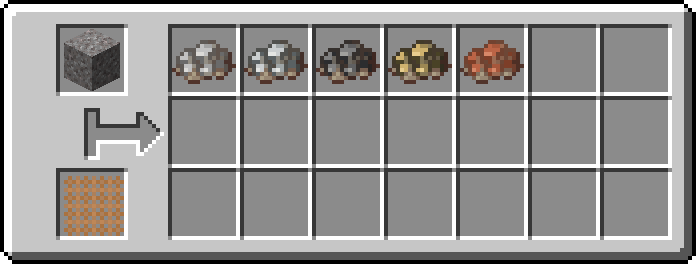

    === "**Sand**"

        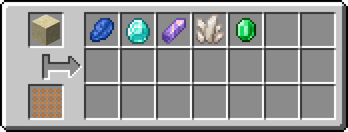

    === "**Dust**"

        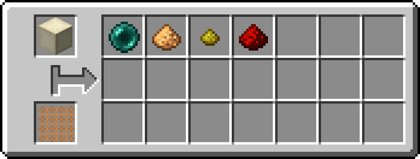

    === "**Crushed Blackstone**"

        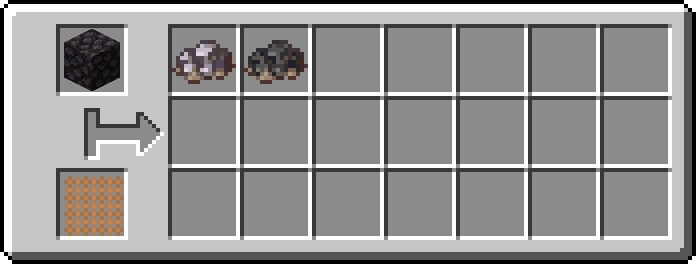

    === "**Mud**"

        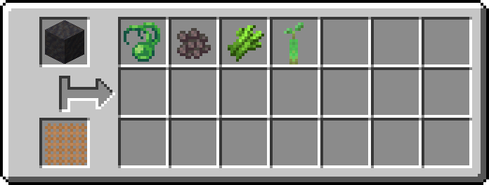

    === "**Dirt**"

        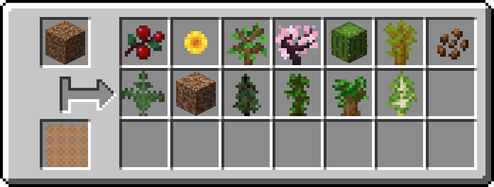

Later on in <LV>**LV**</LV> and <MV>**MV**</MV> you get the **Mechanical Sieve** that takes energy to give a better output of ores and gems compared to manual sieving and they are GT multiblocks so they can be easily automated.

!!! abstract "Mechanical Sieve"

    === "**Gravel**"
        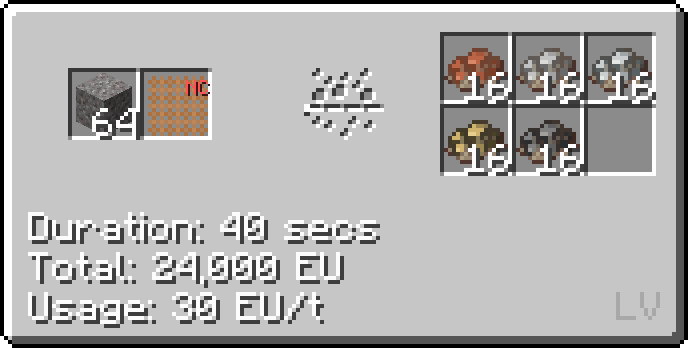

    === "**Sand**"
        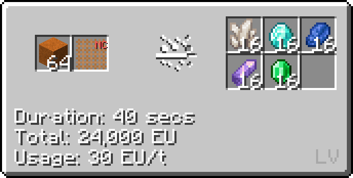
        
        <small>Note: Any sand can be used not only red sand</small>

    === "**Dust**"
        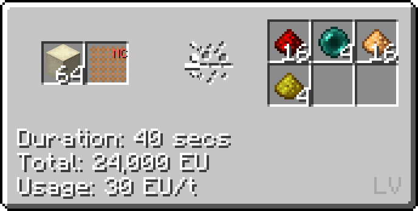

    === "**Crushed Blackstone**"
        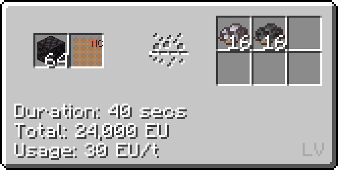

# Mid-Late game Sieving

Later on in the game you can unlock better sieves such as the parallel **Large Sieve** at <IV>**IV**</IV> 75% of the input to give the same output. Even later when you get to <UHV>**UHV**</UHV> you can unlock the **Ancient Refinement Center** which can do the same recipes as the **Large Sieve** but it has access to **subtick parallels** and **bulking**.

!!! abstract "Large Sieve"
    
    === "Gravel"
        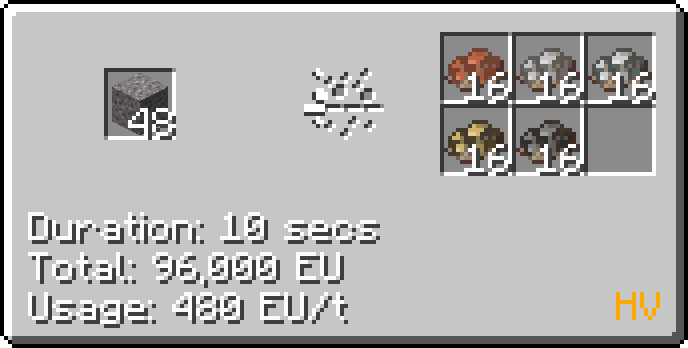

    === "Sand"
        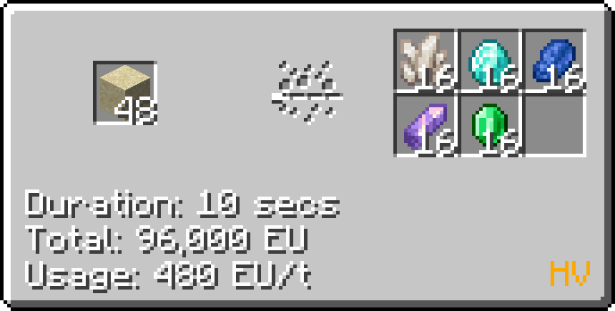

    === "Dust"
        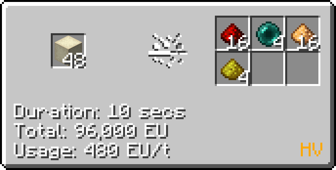
    
    === "Crushed Blackstone"
        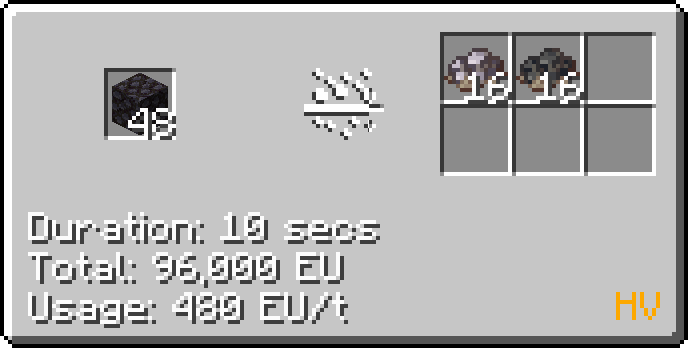